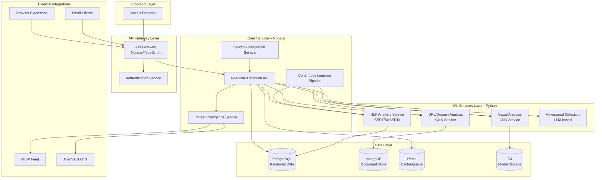

# Backend and Core System Design - 10 Phase Plan

## Architecture Overview

The system follows a microservices architecture with the following key components:

## Phase 1: Core Infrastructure & Architecture Setup

**Objective**: Establish the foundational infrastructure, project structure, and development environment.

**Key Components**:

- AWS infrastructure setup (VPC, ECS/EKS, RDS, ElastiCache, S3)
- Docker containerization for all services
- CI/CD pipeline (GitHub Actions/AWS CodePipeline)
- Service discovery and API Gateway configuration
- Logging and monitoring infrastructure (CloudWatch, Prometheus)

**Deliverables**:

- `backend/` directory structure with microservices
- `backend/api-gateway/` - Node.js/TypeScript API Gateway
- `backend/ml-services/` - Python ML services container
- `backend/core-services/` - Node.js core services
- `backend/shared/` - Shared types, utilities, and configurations
- Docker Compose for local development
- Terraform/CloudFormation for AWS infrastructure
- GitHub Actions workflows for CI/CD

**Technology Stack**:

- AWS: ECS/EKS, RDS PostgreSQL, ElastiCache Redis, S3, API Gateway
- Docker & Docker Compose
- Terraform for Infrastructure as Code
- GitHub Actions for CI/CD

---

## Phase 2: Database Schema & Data Models

**Objective**: Design and implement comprehensive database schemas for all system entities.

**Key Components**:

- PostgreSQL schema for relational data (users, organizations, threats, detections)
- MongoDB collections for document storage (email content, URL analysis results, graph data)
- Redis data structures for caching and real-time queues
- Database migration system

**Core Tables/Collections**:

- `users`, `organizations`, `api_keys`
- `threats`, `detections`, `threat_indicators`
- `domains`, `urls`, `domain_relationships` (graph data)
- `email_messages`, `email_headers`
- `ml_models`, `model_versions`, `training_jobs`
- `threat_intelligence_feeds`, `iocs`
- `sandbox_analyses`, `browser_events`

**Deliverables**:

- `backend/shared/database/schemas/` - SQL schemas and migrations
- `backend/shared/database/models/` - TypeORM/Prisma models
- `backend/shared/database/mongodb/` - MongoDB schemas and models
- Database seeding scripts for development
- Indexing strategy documentation

---

## Phase 3: NLP Text Analysis Service (Python)

**Objective**: Build transformer-based NLP service for semantic analysis of email/SMS content.

**Key Components**:

- Fine-tuned BERT/RoBERTa model for phishing detection
- Text preprocessing pipeline (tokenization, normalization)
- Feature extraction (semantic embeddings, sentiment, urgency indicators)
- Model serving API (FastAPI with ONNX Runtime or TensorFlow Serving)
- Model versioning and A/B testing support

**Features**:

- Email body and header analysis
- SMS content analysis
- AI-generated content detection
- Urgency and social engineering indicators
- Multi-language support (initial: English, expandable)

**Deliverables**:

- `backend/ml-services/nlp-service/` - FastAPI service
- `backend/ml-services/nlp-service/models/` - Pre-trained models
- `backend/ml-services/nlp-service/training/` - Training scripts
- Model evaluation metrics and validation datasets
- API endpoints: `/analyze-text`, `/analyze-email`, `/detect-ai-content`

**Technology Stack**:

- Python 3.11+, FastAPI, Transformers (Hugging Face)
- PyTorch/TensorFlow for model training
- ONNX Runtime for optimized inference
- Redis for model caching

---

## Phase 4: URL/Domain Analysis & Graph Neural Network Service (Python)

**Objective**: Implement graph-based domain analysis using GNNs for relationship mapping and anomaly detection.

**Key Components**:

- Domain graph construction (nodes: domains, IPs, SSL certs, WHOIS records)
- GNN model for relationship analysis and clustering
- URL parsing and normalization (handling redirects, encoding, homoglyphs)
- Domain reputation scoring
- WHOIS analysis and DNS history tracking
- Link traversal engine for redirect chain analysis

**Features**:

- Multi-hop redirect detection
- Domain clustering and infrastructure mapping
- Homoglyph attack detection
- SSL certificate analysis
- Domain age and registration pattern analysis

**Deliverables**:

- `backend/ml-services/url-service/` - FastAPI service
- `backend/ml-services/url-service/graph/` - Graph construction and GNN models
- `backend/ml-services/url-service/analyzers/` - URL, domain, WHOIS analyzers
- `backend/ml-services/url-service/crawler/` - Link traversal engine
- API endpoints: `/analyze-url`, `/analyze-domain`, `/check-redirect-chain`, `/domain-reputation`

**Technology Stack**:

- Python, FastAPI, PyTorch Geometric (PyG) for GNNs
- NetworkX for graph operations
- BeautifulSoup4, Selenium for web crawling
- dnspython for DNS queries

---

## Phase 5: Visual/Structural Analysis Service (CNN - Python)

**Objective**: Build CNN-based service for analyzing webpage DOM structures and visual patterns.

**Key Components**:

- CNN model for webpage screenshot analysis (brand impersonation detection)
- DOM structure analysis and feature extraction
- Visual similarity matching (comparing against known legitimate sites)
- Rendering pattern analysis
- Logo and branding element detection

**Features**:

- Screenshot-based visual analysis
- DOM tree structure comparison
- CSS and layout pattern analysis
- Form field analysis (credential harvesting detection)
- Responsive design pattern detection

**Deliverables**:

- `backend/ml-services/visual-service/` - FastAPI service
- `backend/ml-services/visual-service/models/` - CNN models
- `backend/ml-services/visual-service/renderer/` - Headless browser rendering
- `backend/ml-services/visual-service/analyzer/` - DOM and visual analyzers
- API endpoints: `/analyze-page`, `/compare-visual`, `/analyze-dom`

**Technology Stack**:

- Python, FastAPI, PyTorch/TensorFlow for CNNs
- Playwright/Puppeteer for headless browsing
- OpenCV for image processing
- Selenium for DOM analysis

---

## Phase 6: Real-time Detection API (Node.js/TypeScript)

**Objective**: Build high-performance API service that orchestrates ML services for real-time threat detection.

**Key Components**:

- Request routing and load balancing
- Multi-modal analysis orchestration (combining NLP, URL, Visual results)
- Decision engine (ensemble scoring, threshold management)
- Rate limiting and request queuing
- WebSocket support for real-time event streaming
- Caching layer (Redis) for frequently checked URLs/domains

**Features**:

- Sub-50ms detection latency target
- Parallel ML service calls
- Result aggregation and confidence scoring
- Threat classification and severity assignment
- Real-time event streaming to frontend

**Deliverables**:

- `backend/core-services/detection-api/` - Express.js/Fastify service
- `backend/core-services/detection-api/orchestrator/` - ML service orchestration
- `backend/core-services/detection-api/decision-engine/` - Threat decision logic
- `backend/core-services/detection-api/websocket/` - Real-time event streaming
- API endpoints: `/api/v1/detect`, `/api/v1/analyze-email`, `/api/v1/analyze-url`, `/ws/events`

**Technology Stack**:

- Node.js 20+, TypeScript, Express.js/Fastify
- BullMQ for job queues
- Socket.io for WebSockets
- Redis for caching and queues

---

## Phase 7: Threat Intelligence Integration Service

**Objective**: Integrate with external threat intelligence feeds and build IOC management system.

**Key Components**:

- MISP integration (bidirectional sync)
- AlienVault OTX integration
- IOC ingestion and normalization pipeline
- IOC matching engine (fast lookup for URLs, domains, IPs, hashes)
- Threat feed aggregation and deduplication
- Feed health monitoring and alerting

**Features**:

- Real-time IOC updates from feeds
- IOC enrichment (adding context from multiple sources)
- Custom IOC management (user-submitted indicators)
- Feed reliability scoring
- Historical IOC tracking

**Deliverables**:

- `backend/core-services/threat-intel/` - Node.js service
- `backend/core-services/threat-intel/integrations/` - MISP, OTX connectors
- `backend/core-services/threat-intel/ioc-engine/` - IOC matching and storage
- `backend/core-services/threat-intel/sync/` - Feed synchronization workers
- API endpoints: `/api/v1/iocs`, `/api/v1/feeds`, `/api/v1/check-ioc`

**Technology Stack**:

- Node.js, TypeScript
- MISP API client, OTX API client
- Redis for IOC caching (Bloom filters for fast lookups)
- PostgreSQL for IOC storage

---

## Phase 8: Continuous Learning & Model Training Pipeline

**Objective**: Build automated ML pipeline for incremental learning and model retraining.

**Key Components**:

- Data collection and labeling pipeline (from detections, user feedback)
- Feature store for training data management
- Automated model training workflows (scheduled and trigger-based)
- Model validation and A/B testing framework
- Model deployment automation (canary, blue-green)
- Model performance monitoring and drift detection

**Features**:

- Incremental learning from new threats
- User feedback integration (false positives/negatives)
- Automated retraining triggers (performance degradation, new attack patterns)
- Model versioning and rollback capabilities
- Training data quality checks

**Deliverables**:

- `backend/core-services/learning-pipeline/` - Node.js orchestration service
- `backend/ml-services/training/` - Python training scripts
- `backend/ml-services/training/data-pipeline/` - Data collection and preprocessing
- `backend/ml-services/training/validation/` - Model validation scripts
- `backend/shared/feature-store/` - Feature store implementation
- Scheduled jobs and event-driven training triggers

**Technology Stack**:

- Node.js for orchestration, Python for training
- MLflow for experiment tracking
- Apache Airflow/Prefect for workflow orchestration
- S3 for training data storage
- AWS SageMaker (optional) for managed training

---

## Phase 9: Browser Extension Backend & Edge Integration

**Objective**: Build lightweight backend services for browser extension and email client integration.

**Key Components**:

- Browser extension API endpoints (lightweight, fast)
- Email client webhook handlers (Outlook, Gmail)
- Local model inference support (for offline detection)
- Extension configuration and policy management
- User consent and privacy controls
- Event tracking and analytics

**Features**:

- Real-time URL checking from browser
- Email scanning integration (IMAP/POP3 support)
- Local caching for offline operation
- Privacy-preserving analysis (minimal data transmission)
- User reporting interface

**Deliverables**:

- `backend/core-services/extension-api/` - Lightweight Node.js service
- `backend/core-services/email-integration/` - Email client connectors
- `extensions/` - Browser extension codebase (Chrome, Firefox, Edge)
- API endpoints: `/api/v1/extension/check-url`, `/api/v1/extension/report`, `/api/v1/email/scan`

**Technology Stack**:

- Node.js for backend
- Browser Extension APIs (Chrome, Firefox, Edge)
- TensorFlow.js for local inference (optional)
- WebSocket for real-time updates

---

## Phase 10: Sandbox Integration & Advanced Threat Analysis

**Objective**: Integrate dynamic sandbox environments for behavioral analysis of links and attachments.

**Key Components**:

- Sandbox API integration (Cuckoo, Any.run, or custom)
- File analysis pipeline (PDF, Office docs, executables)
- Behavioral analysis result processing
- Sandbox job queue management
- Integration with detection API for enhanced scoring

**Features**:

- Automated file submission to sandbox
- Behavioral indicator extraction (network activity, file system changes)
- Sandbox result correlation with other detection signals
- Asynchronous analysis workflow (non-blocking for real-time detection)

**Deliverables**:

- `backend/core-services/sandbox-service/` - Node.js service
- `backend/core-services/sandbox-service/integrations/` - Sandbox connectors
- `backend/core-services/sandbox-service/analyzer/` - Result analysis logic
- Job queue for sandbox submissions
- API endpoints: `/api/v1/sandbox/submit`, `/api/v1/sandbox/status`, `/api/v1/sandbox/results`

**Technology Stack**:

- Node.js for orchestration
- Sandbox APIs (Cuckoo Sandbox, Any.run, or AWS security services)
- File parsing libraries (for extracting metadata)

---

## Integration Points with Frontend

The backend will provide REST APIs and WebSocket endpoints that the existing Next.js frontend will consume:

- **Dashboard Data**: `/api/v1/dashboard/stats`, `/api/v1/dashboard/threats`
- **Real-time Events**: WebSocket connection at `/ws/events`
- **Threat Intelligence**: `/api/v1/intelligence/domains`, `/api/v1/intelligence/iocs`
- **Detection Results**: `/api/v1/detections`, `/api/v1/detections/{id}/details`

## Success Metrics

- Detection latency: <50ms for cached, <100ms for new analysis
- Detection accuracy: >95% true positive rate, <2% false positive rate
- System availability: 99.9% uptime
- Scalability: Support 10,000+ concurrent users
- Model retraining: Automated weekly with drift detection