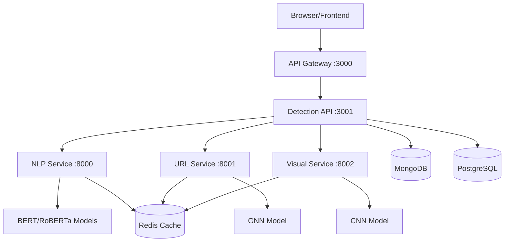

# Implementation Plan: Build Missing ML Services

## Overview

Build three production-ready ML services (NLP, URL, Visual) to provide AI/ML-based phishing detection capabilities. Pre-trained models with 95%+ accuracy will be integrated into FastAPI services that connect with the existing Detection API orchestration layer.

## Architecture Integration



## Service Specifications

### Service Endpoints & Responsibilities

| Service | Port | Models | Primary Function |

|---------|------|--------|-----------------|

| NLP Service | 8000 | BERT/RoBERTa, AI Detector | Email/text semantic analysis |

| URL Service | 8001 | GNN Domain Classifier | URL/domain threat analysis |

| Visual Service | 8002 | CNN Brand Classifier | Webpage visual analysis |

---

## Phase 1: NLP Text Analysis Service

**Location**: `backend/ml-services/nlp-service/`

### 1.1 Project Structure

```
backend/ml-services/nlp-service/
├── src/
│   ├── main.py                          # FastAPI app entry
│   ├── config.py                        # Configuration management
│   ├── models/
│   │   ├── __init__.py
│   │   ├── phishing_classifier.py       # Main BERT/RoBERTa model
│   │   ├── ai_detector.py               # AI-generated content detector
│   │   └── model_loader.py              # Model initialization & caching
│   ├── preprocessing/
│   │   ├── __init__.py
│   │   ├── text_normalizer.py           # Text cleaning & normalization
│   │   ├── email_parser.py              # Email header/body parsing
│   │   └── feature_extractor.py         # Extract NLP features
│   ├── analyzers/
│   │   ├── __init__.py
│   │   ├── urgency_analyzer.py          # Detect urgency tactics
│   │   ├── sentiment_analyzer.py        # Sentiment analysis
│   │   └── social_engineering.py        # Social engineering indicators
│   ├── api/
│   │   ├── __init__.py
│   │   ├── routes.py                    # API endpoints
│   │   └── schemas.py                   # Pydantic request/response models
│   └── utils/
│       ├── __init__.py
│       ├── cache.py                     # Redis caching
│       └── logger.py                    # Logging setup
├── models/                               # Pre-trained model files
│   ├── phishing-detector/               # Your 95%+ accuracy model
│   │   ├── model.bin
│   │   ├── config.json
│   │   └── vocab.txt
│   └── ai-detector/
│       └── model.bin
├── tests/
│   ├── test_api.py
│   ├── test_models.py
│   └── test_preprocessing.py
├── Dockerfile
├── requirements.txt
└── README.md
```

### 1.2 Key Files Implementation

**`requirements.txt`**:

```txt
fastapi==0.104.1
uvicorn[standard]==0.24.0
pydantic==2.5.0
pydantic-settings==2.1.0

# ML Libraries
torch==2.1.0
transformers==4.35.0
sentence-transformers==2.2.2
onnxruntime==1.16.0
scikit-learn==1.3.2

# NLP Tools
nltk==3.8.1
spacy==3.7.2
email-validator==2.1.0

# Database & Cache
redis==5.0.1
pymongo==4.6.0

# Utilities
python-multipart==0.0.6
python-dotenv==1.0.0
```

**API Endpoints**:

- `POST /api/v1/analyze-text` - Analyze plain text for phishing
- `POST /api/v1/analyze-email` - Analyze email content
- `POST /api/v1/detect-ai-content` - Check if content is AI-generated
- `GET /health` - Health check
- `GET /models/info` - Model metadata

**Model Integration**:

- Load your pre-trained models on startup
- Implement model inference pipeline
- Add caching for repeated requests (Redis)
- Handle batch processing for efficiency

### 1.3 Docker Configuration

**`Dockerfile`**:

```dockerfile
FROM python:3.11-slim

WORKDIR /app

# Install system dependencies
RUN apt-get update && apt-get install -y \
    build-essential \
    curl \
    && rm -rf /var/lib/apt/lists/*

COPY requirements.txt .
RUN pip install --no-cache-dir -r requirements.txt

# Download NLTK data
RUN python -c "import nltk; nltk.download('punkt'); nltk.download('stopwords')"

COPY . .

EXPOSE 8000

CMD ["uvicorn", "src.main:app", "--host", "0.0.0.0", "--port", "8000"]
```

---

## Phase 2: URL/Domain Analysis Service

**Location**: `backend/ml-services/url-service/`

### 2.1 Project Structure

```
backend/ml-services/url-service/
├── src/
│   ├── main.py
│   ├── config.py
│   ├── models/
│   │   ├── __init__.py
│   │   ├── gnn_classifier.py            # GNN model wrapper
│   │   └── reputation_scorer.py         # Domain reputation
│   ├── analyzers/
│   │   ├── __init__.py
│   │   ├── url_parser.py                # URL parsing & normalization
│   │   ├── domain_analyzer.py           # Domain characteristics
│   │   ├── dns_analyzer.py              # DNS record analysis
│   │   ├── whois_analyzer.py            # WHOIS lookup
│   │   ├── ssl_analyzer.py              # SSL certificate validation
│   │   └── homoglyph_detector.py        # Detect lookalike domains
│   ├── crawler/
│   │   ├── __init__.py
│   │   ├── redirect_tracker.py          # HTTP redirect chains
│   │   └── link_extractor.py            # Extract links from pages
│   ├── graph/
│   │   ├── __init__.py
│   │   ├── graph_builder.py             # Build domain relationship graph
│   │   └── graph_features.py            # Extract graph features
│   ├── api/
│   │   ├── __init__.py
│   │   ├── routes.py
│   │   └── schemas.py
│   └── utils/
│       ├── __init__.py
│       ├── cache.py
│       └── validators.py
├── models/
│   └── gnn-domain-classifier/           # Your GNN model
│       ├── model.pth
│       └── config.json
├── tests/
├── Dockerfile
├── requirements.txt
└── README.md
```

### 2.2 Dependencies

**`requirements.txt`**:

```txt
fastapi==0.104.1
uvicorn[standard]==0.24.0
pydantic==2.5.0

# ML Libraries
torch==2.1.0
torch-geometric==2.4.0
networkx==3.2.1
numpy==1.24.3

# Web & Network Analysis
requests==2.31.0
beautifulsoup4==4.12.2
dnspython==2.4.2
python-whois==0.8.0
cryptography==41.0.7
tldextract==5.0.1

# Utilities
python-dotenv==1.0.0
redis==5.0.1
```

**API Endpoints**:

- `POST /api/v1/analyze-url` - Complete URL analysis
- `POST /api/v1/analyze-domain` - Domain-only analysis with GNN
- `POST /api/v1/check-redirect-chain` - Track redirects
- `POST /api/v1/detect-homoglyph` - Check for lookalike domains
- `POST /api/v1/domain-reputation` - Get reputation score
- `GET /health`

**Key Features**:

- Parse and normalize URLs
- DNS/WHOIS lookups (with caching)
- SSL certificate validation
- Redirect chain tracking (max 10 hops)
- Homoglyph detection using Unicode analysis
- GNN model inference for domain classification
- Domain age & reputation scoring

---

## Phase 3: Visual/Structural Analysis Service

**Location**: `backend/ml-services/visual-service/`

### 3.1 Project Structure

```
backend/ml-services/visual-service/
├── src/
│   ├── main.py
│   ├── config.py
│   ├── models/
│   │   ├── __init__.py
│   │   ├── cnn_classifier.py            # CNN brand impersonation model
│   │   └── visual_similarity.py         # Perceptual hashing
│   ├── renderer/
│   │   ├── __init__.py
│   │   ├── page_renderer.py             # Playwright headless browser
│   │   └── screenshot_capture.py        # Screenshot utilities
│   ├── analyzers/
│   │   ├── __init__.py
│   │   ├── dom_analyzer.py              # DOM structure analysis
│   │   ├── form_analyzer.py             # Form field detection
│   │   ├── css_analyzer.py              # CSS pattern analysis
│   │   └── logo_detector.py             # Logo detection
│   ├── api/
│   │   ├── __init__.py
│   │   ├── routes.py
│   │   └── schemas.py
│   └── utils/
│       ├── __init__.py
│       ├── image_processor.py
│       └── cache.py
├── models/
│   ├── brand-classifier/                # Your CNN model
│   │   ├── model.pth
│   │   └── config.json
│   └── brand-database/                  # Known brand templates
│       ├── google.json
│       ├── paypal.json
│       └── ...
├── tests/
├── Dockerfile
├── requirements.txt
└── README.md
```

### 3.2 Dependencies

**`requirements.txt`**:

```txt
fastapi==0.104.1
uvicorn[standard]==0.24.0
pydantic==2.5.0

# ML & Image Processing
torch==2.1.0
torchvision==0.16.0
opencv-python==4.8.1.78
Pillow==10.1.0
scikit-image==0.22.0
imagehash==4.3.1

# Headless Browser
playwright==1.40.0
beautifulsoup4==4.12.2

# AWS (for screenshot storage)
boto3==1.29.7

# Utilities
numpy==1.24.3
python-dotenv==1.0.0
redis==5.0.1
```

**API Endpoints**:

- `POST /api/v1/analyze-page` - Full webpage analysis
- `POST /api/v1/analyze-dom` - DOM structure only
- `POST /api/v1/detect-brand` - Brand impersonation check
- `POST /api/v1/compare-visual` - Compare two URLs visually
- `POST /api/v1/analyze-screenshot` - Analyze uploaded screenshot
- `GET /health`

**Key Features**:

- Render pages with Playwright (headless Chromium)
- Capture full-page screenshots
- Analyze DOM structure (forms, links, scripts)
- Detect credential harvesting forms
- CNN-based brand classification
- Visual similarity using perceptual hashing
- Logo detection and matching
- CSS pattern analysis

### 3.3 Playwright Setup

Need to install browser binaries in Docker:

```dockerfile
RUN playwright install chromium
RUN playwright install-deps
```

---

## Phase 4: Docker Compose Integration

**Update**: `backend/docker-compose.yml`

Add three new services:

```yaml
  nlp-service:
    build:
      context: ./ml-services/nlp-service
      dockerfile: Dockerfile
    ports:
      - "8000:8000"
    environment:
      - MODEL_DIR=/app/models
      - REDIS_URL=redis://redis:6379
      - MONGODB_URL=mongodb://mongodb:27017/phishing_detection
      - LOG_LEVEL=info
    volumes:
      - ./ml-services/nlp-service:/app
      - nlp_models:/app/models
    depends_on:
      - redis
      - mongodb
    healthcheck:
      test: ["CMD", "curl", "-f", "http://localhost:8000/health"]
      interval: 30s
      timeout: 10s
      retries: 3
    restart: unless-stopped

  url-service:
    build:
      context: ./ml-services/url-service
      dockerfile: Dockerfile
    ports:
      - "8001:8001"
    environment:
      - MODEL_DIR=/app/models
      - REDIS_URL=redis://redis:6379
      - LOG_LEVEL=info
    volumes:
      - ./ml-services/url-service:/app
      - url_models:/app/models
    depends_on:
      - redis
    healthcheck:
      test: ["CMD", "curl", "-f", "http://localhost:8001/health"]
      interval: 30s
      timeout: 10s
      retries: 3
    restart: unless-stopped

  visual-service:
    build:
      context: ./ml-services/visual-service
      dockerfile: Dockerfile
    ports:
      - "8002:8002"
    environment:
      - MODEL_DIR=/app/models
      - REDIS_URL=redis://redis:6379
      - S3_BUCKET=${S3_BUCKET_NAME}
      - AWS_REGION=ap-south-1
      - LOG_LEVEL=info
    volumes:
      - ./ml-services/visual-service:/app
      - visual_models:/app/models
    depends_on:
      - redis
    healthcheck:
      test: ["CMD", "curl", "-f", "http://localhost:8002/health"]
      interval: 30s
      timeout: 10s
      retries: 3
    restart: unless-stopped

volumes:
  nlp_models:
  url_models:
  visual_models:
```

---

## Phase 5: Detection API Integration

**Update**: `backend/core-services/detection-api/src/services/orchestrator.service.ts`

Add ML service URLs:

```typescript
private readonly NLP_SERVICE_URL = process.env.NLP_SERVICE_URL || 'http://nlp-service:8000';
private readonly URL_SERVICE_URL = process.env.URL_SERVICE_URL || 'http://url-service:8001';
private readonly VISUAL_SERVICE_URL = process.env.VISUAL_SERVICE_URL || 'http://visual-service:8002';
```

Update orchestrator methods to call actual ML services:

```typescript
async analyzeEmail(emailData: EmailAnalysisRequest): Promise<ThreatAnalysis> {
  const [nlpResult, urlResults, visualResult] = await Promise.all([
    // Call NLP service
    axios.post(`${this.NLP_SERVICE_URL}/api/v1/analyze-email`, emailData),
    
    // Extract URLs and analyze each
    this.analyzeExtractedUrls(emailData.urls),
    
    // Analyze any embedded images/HTML
    this.analyzeEmailVisual(emailData.html)
  ]);

  // Combine results with decision engine
  return this.decisionEngine.combineResults({
    nlp: nlpResult.data,
    url: urlResults,
    visual: visualResult
  });
}
```

**Files to Update**:

1. [`backend/core-services/detection-api/src/services/orchestrator.service.ts`](backend/core-services/detection-api/src/services/orchestrator.service.ts) - Add ML service calls
2. [`backend/core-services/detection-api/src/config/index.ts`](backend/core-services/detection-api/src/config/index.ts) - Add ML service URLs
3. [`backend/core-services/detection-api/.env.example`](backend/core-services/detection-api/.env.example) - Document new env vars

---

## Phase 6: Model Integration (When Models Arrive)

### 6.1 Model Placement

When you receive the trained models tomorrow:

**NLP Models**:

```
backend/ml-services/nlp-service/models/
├── phishing-detector/
│   ├── pytorch_model.bin
│   ├── config.json
│   ├── tokenizer.json
│   └── vocab.txt
└── ai-detector/
    ├── pytorch_model.bin
    └── config.json
```

**URL Model**:

```
backend/ml-services/url-service/models/
└── gnn-domain-classifier/
    ├── model.pth
    ├── config.json
    └── graph_config.json
```

**Visual Model**:

```
backend/ml-services/visual-service/models/
├── brand-classifier/
│   ├── model.pth
│   ├── config.json
│   └── class_names.json
└── brand-templates/
    └── (brand logo hashes/templates)
```

### 6.2 Model Loading Code

**NLP Service** - `src/models/phishing_classifier.py`:

```python
from transformers import AutoTokenizer, AutoModelForSequenceClassification
import torch

class PhishingClassifier:
    def __init__(self, model_path: str, device: str = "cpu"):
        self.device = device
        self.tokenizer = AutoTokenizer.from_pretrained(model_path)
        self.model = AutoModelForSequenceClassification.from_pretrained(model_path)
        self.model.to(device)
        self.model.eval()
    
    def predict(self, text: str) -> dict:
        inputs = self.tokenizer(
            text, 
            truncation=True, 
            max_length=512, 
            padding=True, 
            return_tensors="pt"
        ).to(self.device)
        
        with torch.no_grad():
            outputs = self.model(**inputs)
            probs = torch.softmax(outputs.logits, dim=-1)
        
        return {
            "phishing_probability": probs[0][1].item(),
            "legitimate_probability": probs[0][0].item(),
            "confidence": abs(probs[0][1].item() - probs[0][0].item())
        }
```

**URL Service** - `src/models/gnn_classifier.py`:

```python
import torch
from torch_geometric.data import Data

class DomainGNNClassifier:
    def __init__(self, model_path: str, device: str = "cpu"):
        self.device = device
        self.model = torch.load(model_path, map_location=device)
        self.model.eval()
    
    def predict(self, graph_data: Data) -> dict:
        with torch.no_grad():
            output = self.model(graph_data)
            probs = torch.softmax(output, dim=1)
        
        return {
            "malicious_probability": probs[0][1].item(),
            "legitimate_probability": probs[0][0].item(),
            "confidence": abs(probs[0][1].item() - probs[0][0].item())
        }
```

**Visual Service** - `src/models/cnn_classifier.py`:

```python
import torch
from torchvision import transforms
from PIL import Image

class BrandClassifier:
    def __init__(self, model_path: str, device: str = "cpu"):
        self.device = device
        self.model = torch.load(model_path, map_location=device)
        self.model.eval()
        
        self.transform = transforms.Compose([
            transforms.Resize((224, 224)),
            transforms.ToTensor(),
            transforms.Normalize(mean=[0.485, 0.456, 0.406], 
                               std=[0.229, 0.224, 0.225])
        ])
    
    def predict(self, image_bytes: bytes) -> dict:
        image = Image.open(io.BytesIO(image_bytes)).convert('RGB')
        image_tensor = self.transform(image).unsqueeze(0).to(self.device)
        
        with torch.no_grad():
            output = self.model(image_tensor)
            probs = torch.softmax(output, dim=1)
        
        top_prob, top_class = torch.max(probs, 1)
        
        return {
            "brand_id": top_class.item(),
            "confidence": top_prob.item(),
            "is_impersonation": top_prob.item() > 0.85
        }
```

---

## Phase 7: Testing & Validation

### 7.1 Unit Tests

**For each service**, create tests:

```python
# tests/test_api.py
import pytest
from fastapi.testclient import TestClient
from src.main import app

client = TestClient(app)

def test_health_check():
    response = client.get("/health")
    assert response.status_code == 200
    assert response.json()["status"] == "healthy"

def test_analyze_text():
    response = client.post("/api/v1/analyze-text", json={
        "text": "Urgent! Your account will be suspended. Click here to verify."
    })
    assert response.status_code == 200
    data = response.json()
    assert "phishing_probability" in data
    assert data["phishing_probability"] > 0.5  # Should detect as phishing
```

### 7.2 Integration Testing

Test full flow: Frontend → API Gateway → Detection API → ML Services

```bash
# Test email detection
curl -X POST http://localhost:3000/api/v1/detect/email \
  -H "Content-Type: application/json" \
  -H "X-API-Key: your-api-key" \
  -d '{
    "emailContent": "Urgent: Verify your account now!",
    "sender": "noreply@suspicious.com"
  }'
```

### 7.3 Performance Testing

Validate latency requirements:

- NLP inference: <50ms
- URL analysis: <200ms  
- Visual analysis: <5s (with rendering)
- Total detection: <100ms (cached) to <10s (full analysis)

---

## Phase 8: Production Deployment

### 8.1 Environment Variables

Create `.env` files for each service:

**`nlp-service/.env`**:

```env
MODEL_DIR=/app/models
REDIS_URL=redis://redis:6379
MONGODB_URL=mongodb://mongodb:27017
LOG_LEVEL=info
INFERENCE_DEVICE=cpu  # or 'cuda' if GPU available
BATCH_SIZE=32
MAX_SEQUENCE_LENGTH=512
```

**`url-service/.env`**:

```env
MODEL_DIR=/app/models
REDIS_URL=redis://redis:6379
DNS_TIMEOUT=5
WHOIS_TIMEOUT=10
MAX_REDIRECTS=10
ENABLE_SSL_VERIFY=true
```

**`visual-service/.env`**:

```env
MODEL_DIR=/app/models
REDIS_URL=redis://redis:6379
S3_BUCKET=phishing-detection-screenshots
AWS_REGION=ap-south-1
BROWSER_TIMEOUT=30000
SCREENSHOT_QUALITY=80
```

### 8.2 GitHub Actions CI/CD

Update `.github/workflows/backend-ci.yml` to include ML services:

```yaml
jobs:
  test:
    strategy:
      matrix:
        service: 
          - nlp-service
          - url-service
          - visual-service
    steps:
      - name: Test ${{ matrix.service }}
        run: |
          cd backend/ml-services/${{ matrix.service }}
          pip install -r requirements.txt
          pytest tests/
```

---

## Implementation Timeline

### Day 1-2: NLP Service Foundation

- ✅ Create project structure
- ✅ Implement FastAPI app skeleton
- ✅ Build email parser & text normalizer
- ✅ Create API endpoints
- ✅ Add urgency/sentiment analyzers
- ✅ Docker setup
- ⏳ Wait for model delivery

### Day 2-3: URL Service Foundation

- ✅ Create project structure
- ✅ Implement URL parser & validators
- ✅ Add DNS/WHOIS analyzers
- ✅ Build redirect tracker
- ✅ Implement homoglyph detector
- ✅ Create API endpoints
- ✅ Docker setup

### Day 3-4: Visual Service Foundation

- ✅ Create project structure
- ✅ Setup Playwright renderer
- ✅ Build DOM analyzer
- ✅ Implement form analyzer
- ✅ Create API endpoints
- ✅ Docker setup

### Day 4: Model Integration (CONFIRMED - MODELS ARRIVING TOMORROW)

- 🎯 **Receive trained models with 95%+ accuracy**
- ✅ Place models in correct directories
- ✅ Implement model loading code
- ✅ Test inference pipelines
- ✅ Verify accuracy matches specifications
- ✅ Run benchmark tests

### Day 5: Detection API Integration

- ✅ Update orchestrator service
- ✅ Add ML service URLs to config
- ✅ Update decision engine weights
- ✅ Test end-to-end flow

### Day 6-7: Testing & Optimization

- ✅ Unit tests for all services
- ✅ Integration tests
- ✅ Performance optimization
- ✅ Caching implementation
- ✅ Error handling

### Day 8: Production Deployment

- ✅ Deploy to AWS ECS
- ✅ Configure monitoring
- ✅ Load testing
- ✅ Documentation

---

## Success Criteria

### Functional Requirements

- ✅ All three ML services running and responsive
- ✅ Models loaded successfully with 95%+ accuracy
- ✅ Detection API successfully orchestrates all services
- ✅ End-to-end detection flow works for email, URL, and webpage analysis
- ✅ Results properly aggregated by decision engine

### Performance Requirements

- ✅ NLP inference: <50ms per request
- ✅ URL analysis: <200ms per URL
- ✅ Visual analysis: <5s with rendering
- ✅ Cache hit rate: >70%
- ✅ Service uptime: 99.9%

### Quality Requirements

- ✅ Phishing detection accuracy: >95%
- ✅ False positive rate: <2%
- ✅ Test coverage: >80%
- ✅ All health checks passing
- ✅ Proper error handling and logging

---

## Quick Start Commands

Once implementation is complete:

```bash
# 1. Start all services
cd backend
docker-compose up -d

# 2. Verify services are healthy
docker-compose ps

# 3. Check ML service logs
docker-compose logs nlp-service
docker-compose logs url-service
docker-compose logs visual-service

# 4. Test individual services
curl http://localhost:8000/health  # NLP
curl http://localhost:8001/health  # URL
curl http://localhost:8002/health  # Visual

# 5. Test full detection flow
curl -X POST http://localhost:3000/api/v1/detect/email \
  -H "Content-Type: application/json" \
  -H "X-API-Key: test-key" \
  -d @test-email.json

# 6. Monitor with logs
docker-compose logs -f detection-api nlp-service url-service visual-service
```

---

## Risk Mitigation

> **Note**: Your 95%+ accuracy models are confirmed to arrive tomorrow. All implementation is optimized for these production-ready models.

### If Performance Issues

- Enable GPU inference (CUDA)
- Implement request batching
- Add more aggressive caching
- Use ONNX Runtime for faster inference
- Deploy multiple replicas with load balancing

### If Integration Issues

- Test each service independently first
- Use mock responses for debugging
- Add detailed logging at each integration point
- Implement circuit breakers for resilience

---

## Next Steps After Completion

1. **Adversarial Detection** - Add AI-generated content detection layer
2. **Edge Inference** - Deploy lightweight models to browser extension
3. **Model Monitoring** - Track drift and performance degradation
4. **A/B Testing** - Compare model versions in production
5. **Auto-Retraining** - Enable continuous learning pipeline