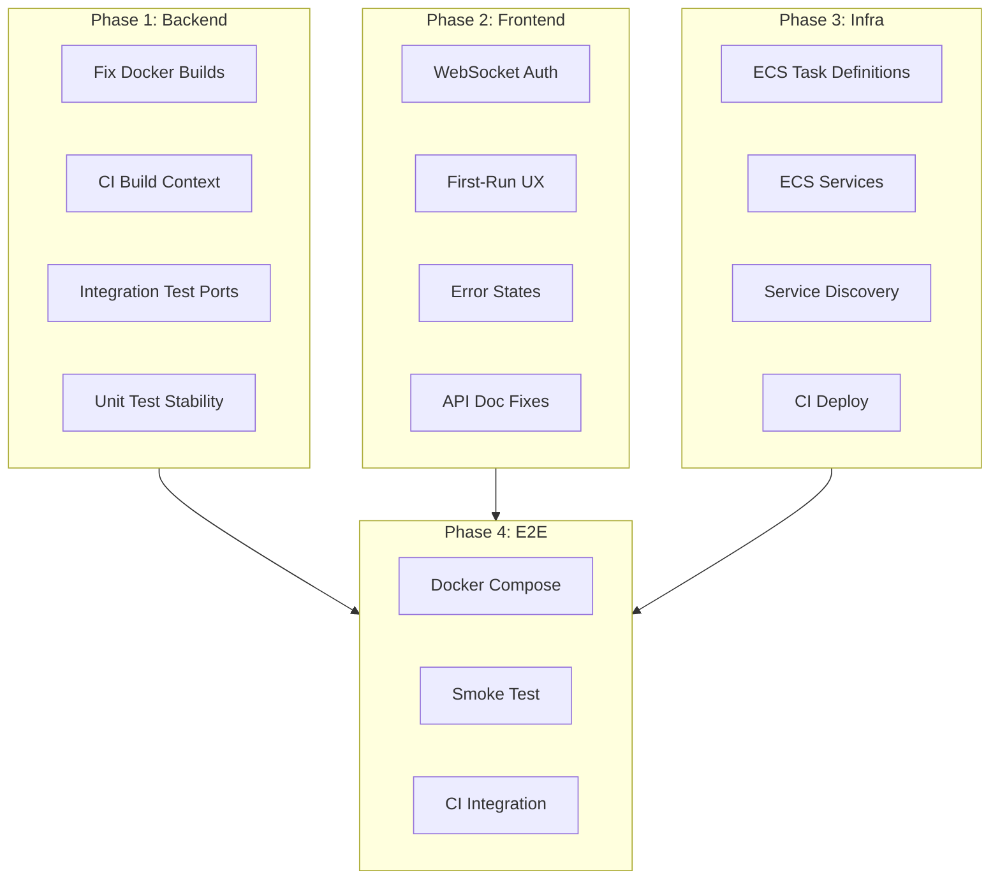

# Full End-to-End Build to 100% Completion

## Current State (from PROJECT_COMPLETION_ANALYSIS_AND_PLAN.md)


| Area           | Stated Current | Target | Key Gaps                                                                                   |
| -------------- | -------------- | ------ | ------------------------------------------------------------------------------------------ |
| Backend        | 90%            | 100%   | Docker builds (some services), CI build context, integration test ports, learning-pipeline |
| Frontend       | 75-80%         | 100%   | WebSocket auth wiring, runtime API/WS URL override, error states, first-run UX             |
| Infrastructure | 85-95%         | 100%   | **No ECS task definitions or services** in Terraform, only cluster/ALB/namespace           |


---

## Phase 1: Backend to 100% (Docker + CI + Tests)

### 1.1 Fix Remaining Docker Builds

**Problem:** [backend/core-services/detection-api/Dockerfile](backend/core-services/detection-api/Dockerfile) was fixed (COPY path, TypeORM alignment). Other core services may have similar issues.

**Actions:**

- Audit and fix Dockerfiles for **threat-intel**, **extension-api**, **sandbox-service**, **learning-pipeline** using the detection-api pattern:
  - Build context must be `backend/` (not `backend/core-services/X/`)
  - COPY `core-services/X/` into correct destination; ensure tsconfig/src are present
  - Shared dependency resolution: symlink `shared/node_modules` to service's node_modules or merge deps
- Add **learning-pipeline** to lint-and-test matrix in [.github/workflows/backend-ci.yml](.github/workflows/backend-ci.yml) (it is in build-docker-images but not lint matrix)
- Fix CI Docker build commands: use `backend/` as context with `-f backend/core-services/X/Dockerfile` for Node services; ML services use `backend/ml-services/X/` as context

### 1.2 CI Docker Build Context

**File:** [.github/workflows/backend-ci.yml](.github/workflows/backend-ci.yml) (lines 89-97)

Current logic builds from wrong context for Node services that depend on shared:

```yaml
# Current (wrong for detection-api, threat-intel, etc.):
docker build ... backend/core-services/detection-api/
# Detection-api Dockerfile expects context backend/ and copies shared, core-services/detection-api
```

**Fix:** For api-gateway: `backend/` context, `-f backend/api-gateway/Dockerfile`. For detection-api, threat-intel, extension-api, sandbox-service: `backend/` context, `-f backend/core-services/$svc/Dockerfile`.

### 1.3 Integration Test Fixes

**File:** [backend/tests/integration/detection-pipeline.test.ts](backend/tests/integration/detection-pipeline.test.ts)

- Wrong default ports: `NLP_SERVICE` 8001 → 8000, `URL_SERVICE` 8002 → 8001. Add `VISUAL_SERVICE` 8002.
- Syntax: The describe block appears wrapped in an IIFE `() => {` — remove or fix so tests execute.
- Ensure `TEST_API_KEY` is documented in runbook; smoke test and integration tests depend on it.

### 1.4 Unit Test Stability

- Replace any `npm test || echo "..."` with real test commands; ensure each service has at least a passing smoke test (e.g., `jest --passWithNoTests` or minimal unit test).
- Fix detection-api analytics `req.user` → `req.organizationId` (already done per conversation summary).

---

## Phase 2: Frontend to 100%

### 2.1 WebSocket Auth and Runtime URL

**Files:** [hooks/use-websocket.ts](hooks/use-websocket.ts), [components/realtime-monitor.tsx](components/realtime-monitor.tsx)

- **useWebSocket:** Accept runtime `apiUrl`/`wsUrl` (from localStorage) instead of only build-time `NEXT_PUBLIC_*`. When `api_url` in localStorage, use it for WebSocket; when `api_key` exists, pass to `auth.apiKey` and `extraHeaders`.
- **RealtimeMonitor:** Read `api_key` and `organizationId` (or derived from API) from localStorage; pass to `useWebSocket({ apiKey, organizationId, ... })`.
- **Settings:** Add optional "WebSocket URL" override in ApiSettings if different from API URL (e.g., `ws_url` in localStorage). Default: same as API URL.

### 2.2 First-Run and API Key Onboarding

- On app load, if no `api_key` in localStorage and user lands on a page that needs it (e.g., Detection, Dashboard), show a dismissible banner: "Configure your API key in Settings to enable detection."
- Optionally, redirect to Settings on first visit if no key.

### 2.3 Error States and Loading

- Add loading skeletons for dashboard, detection, IOC, feeds pages where data is fetched.
- Improve error boundaries and user-facing messages (e.g., "API unavailable — check Settings" with link to Settings).

### 2.4 API Documentation and Correct Ports

- Fix [docs/API_REFERENCE.md](docs/API_REFERENCE.md) port table: Detection API 3001, Threat Intel 3002, Extension API 3003, Sandbox 3004 (match docker-compose).

---

## Phase 3: Infrastructure to 100%

### 3.1 Terraform: Add ECS Task Definitions and Services

**Current gap:** [backend/infrastructure/terraform/modules/ecs/main.tf](backend/infrastructure/terraform/modules/ecs/main.tf) defines cluster, ALB, target group for api-gateway, service discovery namespace — but **no** `aws_ecs_task_definition` or `aws_ecs_service` resources.

**Actions:**

- Add ECS task definitions for:
  1. **api-gateway** (linked to ALB target group)
  2. **detection-api**, **threat-intel**, **extension-api**, **sandbox-service** (internal, service discovery)
  3. **nlp-service**, **url-service**, **visual-service** (internal, service discovery)
- Add ECS services that:
  - Use the task definitions
  - Register with `aws_service_discovery_service` in the existing namespace
  - Have correct env vars (DB URLs from RDS/ElastiCache modules, inter-service URLs via service discovery)
- Wire api-gateway service to ALB target group; other services accessible via `detection-api.phishing-detection-dev.local`, etc.

### 3.2 Terraform Backend and Secrets

- Ensure [backend/infrastructure/terraform/BOOTSTRAP.md](backend/infrastructure/terraform/BOOTSTRAP.md) is complete.
- Document `TF_VAR_db_password` and other secrets in [docs/DEPLOYMENT_RUNBOOK.md](docs/DEPLOYMENT_RUNBOOK.md).
- Verify `terraform plan` and `terraform apply` succeed for dev (with placeholder/mock secrets if needed).

### 3.3 CI Deploy Step

**File:** [.github/workflows/backend-ci.yml](.github/workflows/backend-ci.yml)

- Deploy job runs `terraform apply` and then `aws ecs update-service` for each service. Ensure service names match Terraform output (e.g., `phishing-detection-api-gateway-dev`).
- Fix service naming to match Terraform-created resources.

---

## Phase 4: End-to-End Validation

### 4.1 Root Docker Compose

- Ensure [docker-compose.yml](docker-compose.yml) (root) includes backend via `include` and frontend service.
- Run `docker compose up --build` from root; verify all services start.
- Document in README: `cp .env.example .env`, set `POSTGRES_PASSWORD`, then `docker compose up --build`.

### 4.2 Smoke and Integration Tests in CI

- [scripts/smoke-test.sh](scripts/smoke-test.sh): Ensure it works against `http://localhost:3000` (api-gateway). Smoke job starts postgres, mongodb, redis, api-gateway, detection-api (and optionally ML services).
- Integration test job: Run after deploy or against local stack; fix `needs: deploy-dev` so it can run on PRs (e.g., against docker-compose).
- Add frontend build step to CI (e.g., `npm run build` in root) to catch frontend regressions.

### 4.3 OpenAPI / Swagger (Optional but Recommended)

- Add OpenAPI spec for detection-api (and optionally extension-api, threat-intel).
- Serve `/api-docs` via Swagger UI; document in API_REFERENCE.

---

## Dependency Graph




---

## Summary of Key Files


| Area               | Key Files                                                              |
| ------------------ | ---------------------------------------------------------------------- |
| Backend Docker     | `backend/core-services/*/Dockerfile`, `backend/api-gateway/Dockerfile` |
| CI                 | `.github/workflows/backend-ci.yml`                                     |
| Integration Tests  | `backend/tests/integration/detection-pipeline.test.ts`                 |
| Frontend WebSocket | `hooks/use-websocket.ts`, `components/realtime-monitor.tsx`            |
| Frontend Settings  | `components/settings/api-settings.tsx`                                 |
| Terraform ECS      | `backend/infrastructure/terraform/modules/ecs/main.tf`                 |
| Root Compose       | `docker-compose.yml`, `Dockerfile` (frontend)                          |


---

## Estimated Effort


| Phase     | Focus                       | Effort        |
| --------- | --------------------------- | ------------- |
| 1         | Backend Docker + CI + tests | 2-3 days      |
| 2         | Frontend WebSocket + UX     | 1-2 days      |
| 3         | Terraform ECS services      | 3-4 days      |
| 4         | E2E validation + CI         | 1-2 days      |
| **Total** |                             | **7-11 days** |


