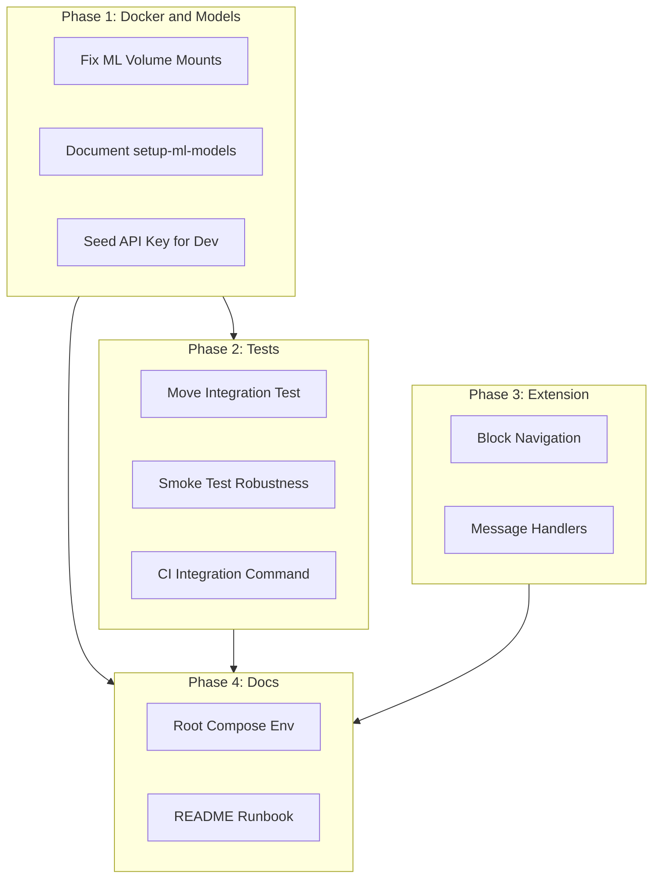

# Full Stack End-to-End Completion Plan

## Current State Summary

The system has substantial components built:

- **Backend**: 9 services (api-gateway, detection-api, threat-intel, extension-api, sandbox-service, learning-pipeline, nlp-service, url-service, visual-service)
- **ML Models**: Integrated (BERT phishing, AI detector, CNN visual, GNN URL) with models in `backend/ml-services/*/models/`
- **Frontend**: Next.js app with detection, dashboard, IOC, feeds, settings
- **Extension**: Chrome/Edge/Firefox with URL check, blocked.html
- **Infrastructure**: Terraform with ECS task definitions
- **CI**: Backend CI (lint, build, deploy), Frontend CI (build)

## Gap Analysis


| Area                   | Gap                                                                             | Impact                                            |
| ---------------------- | ------------------------------------------------------------------------------- | ------------------------------------------------- |
| **Docker + Models**    | ML services use named volumes (`nlp_models`, etc.) that override host `models/` | Models not loaded in containers                   |
| **API Key**            | No automatic seed on first run                                                  | Smoke/integration tests fail without manual setup |
| **Integration Tests**  | Tests in `backend/tests/` but Jest runs from `detection-api/`                   | Tests not discovered                              |
| **Extension Blocking** | Background doesn't block navigation to flagged URLs                             | Blocked page never shown                          |
| **Root Compose**       | Frontend depends on api-gateway; backend may lack extension-api in minimal run  | Incomplete stack                                  |


---

## Phase 1: Docker Compose and ML Models (Critical)

### 1.1 Fix ML Service Model Mounts

**Problem:** [backend/docker-compose.yml](backend/docker-compose.yml) mounts named volumes (`nlp_models`, `url_models`, `visual_models`) at `/app/models`, which overrides the bind-mounted host directory. Models in `ml-services/*/models/` are never visible.

**Fix:** Replace named volumes with bind mounts to host model directories so `./scripts/setup-ml-models.sh` populates models that containers see:

```yaml
# nlp-service, url-service, visual-service - change volumes:
volumes:
  - ./ml-services/nlp-service:/app
  # Remove: nlp_models:/app/models
  # Models path is now ./ml-services/nlp-service/models (from first mount)
```

Remove the named volume declarations and references for `nlp_models`, `url_models`, `visual_models`.

### 1.2 Ensure Models Exist Before First Run

**File:** [scripts/setup-ml-models.sh](scripts/setup-ml-models.sh) (already exists)

**Action:** Update [README.md](README.md) Quick Start to include:

```bash
./scripts/setup-ml-models.sh   # Run BEFORE docker compose up
```

Add a pre-up check script or document clearly that models must exist.

### 1.3 API Key Seeding for First Run

**Problem:** Detection API requires API key; smoke/integration tests need `TEST_API_KEY`. Database init does not seed an API key.

**Files:**

- [backend/shared/database/init/](backend/shared/database/init/) – add SQL seed or use [backend/shared/scripts/create-initial-setup.ts](backend/shared/scripts/create-initial-setup.ts)
- [backend/shared/database/init/](backend/shared/database/init/) – create `003-seed-api-key.sql` that inserts a default test org + API key (hash of known test key) for local dev

**Alternative:** Add an entrypoint or init container that runs `create-initial-setup.ts` when `POSTGRES_PASSWORD` is set and no API keys exist. Or document: "Run `ts-node shared/scripts/create-initial-setup.ts` after first compose up."

**Recommended:** Add `003-seed-api-key.sql` that inserts org + api_key with a deterministic hash for `testkey_smoke_test_12345` (document this in runbook as `TEST_API_KEY`).

---

## Phase 2: Integration Tests and Smoke

### 2.1 Wire Integration Tests to Jest

**Problem:** Real integration tests live in [backend/tests/integration/detection-pipeline.test.ts](backend/tests/integration/detection-pipeline.test.ts), but [backend/core-services/detection-api/tests/jest.config.ts](backend/core-services/detection-api/tests/jest.config.ts) only searches `detection-api/tests` and `detection-api/src`. The `test:integration` script never runs `backend/tests/`.

**Fix options:**

- **A:** Move `detection-pipeline.test.ts` into `backend/core-services/detection-api/tests/integration/` and adjust imports.
- **B:** Add a root-level or backend-level Jest config that runs `backend/tests/integration/*.test.ts` and add npm script in `backend/package.json` (if it exists) or detection-api.

**Recommended:** Option A – move the file so detection-api owns it. The test imports `axios`, `dotenv`; ensure detection-api has these deps (it uses axios via orchestrator, so add `dotenv` if needed).

### 2.2 Smoke Test Robustness

**File:** [scripts/smoke-test.sh](scripts/smoke-test.sh)

- Ensure it passes when `TEST_API_KEY` is empty but auth is optional (or document that key is required).
- The script already falls back to 3001. Verify the detection API route `/api/v1/detect/url` exists and returns `isThreat` or `is_threat`.

### 2.3 CI Integration Test Command

**File:** [.github/workflows/backend-ci.yml](.github/workflows/backend-ci.yml) (integration-tests job)

- Currently runs `npm run test:integration` from `backend/core-services/detection-api`. After moving the integration test, ensure the moved test is found.
- The integration test exits with code 1 if `TEST_API_KEY` is unset. CI needs `TEST_API_KEY` secret. Document in runbook.
- Optionally: make integration test skip or use a default when no key (for PRs without secret).

---

## Phase 3: Extension Blocking Flow

### 3.1 Implement Navigation Blocking

**File:** [extensions/chrome/background.js](extensions/chrome/background.js)

**Current:** URL is checked, badge updated; no navigation blocking.

**Required:**

- Use `chrome.webRequest.onBeforeRequest` or `declarativeNetRequest` to block requests when URL is flagged as threat.
- Redirect blocked navigation to `blocked.html?url=...&type=...&severity=...&confidence=...&indicators=...`
- Maintain an in-memory or `chrome.storage` set of URLs currently marked as threats (updated when check returns `isThreat: true`).
- Handle caching: when a URL is checked and is threat, add to blocklist; optionally expire after TTL.

**Reference:** [extensions/chrome/blocked.html](extensions/chrome/blocked.html) already accepts query params (`url`, `type`, `severity`, `confidence`, `indicators`) and has "Proceed Anyway" which sends `allowlistUrl` to background.

### 3.2 Background Message Handlers

Ensure `background.js` handles:

- `reportThreat` – forward to Extension API if available
- `allowlistUrl` – remove URL from blocklist, allow navigation
- `checkUrl` – existing; ensure response is used to update blocklist before navigation completes

---

## Phase 4: Root Docker Compose and Documentation

### 4.1 Root Compose Completeness

**File:** [docker-compose.yml](docker-compose.yml)

- Includes `backend/docker-compose.yml` and adds `frontend`.
- Frontend builds with `NEXT_PUBLIC_API_URL` and `NEXT_PUBLIC_WS_URL` (default localhost:3000).
- Ensure backend includes all services frontend needs: api-gateway, detection-api, threat-intel, extension-api (for extension), ML services.

**Check:** Does api-gateway have `EXTENSION_API_URL` and `SANDBOX_SERVICE_URL`? [backend/api-gateway](backend/api-gateway) config uses env with defaults. Add to api-gateway service in docker-compose for clarity:

```yaml
- EXTENSION_API_URL=http://extension-api:3003
- SANDBOX_SERVICE_URL=http://sandbox-service:3004
```

### 4.2 Minimal vs Full Stack

**Option:** Define two profiles in backend docker-compose:

- `minimal`: postgres, redis, mongodb, api-gateway, detection-api, nlp-service, url-service, visual-service (for quick local dev)
- Default/full: all services including threat-intel, extension-api, sandbox-service, learning-pipeline

Document in README: `docker compose --profile minimal up` vs `docker compose up`.

### 4.3 README and Runbook Updates

**Files:** [README.md](README.md), [docs/DEPLOYMENT_RUNBOOK.md](docs/DEPLOYMENT_RUNBOOK.md)

- Quick Start: `cp .env.example .env`, set `POSTGRES_PASSWORD`, run `./scripts/setup-ml-models.sh`, then `docker compose up --build`.
- Document `TEST_API_KEY` for smoke/integration tests and how to create it.
- Fix port table in DEPLOYMENT_RUNBOOK if Detection API is listed as 3002 (it should be 3001).

---

## Phase 5: Optional Hardening

- **Frontend API URL at runtime:** Allow override via Settings (localStorage) so users can point to deployed backend without rebuild.
- **Sandbox fallback:** Sandbox service fails without ANYRUN/Cuckoo keys. Ensure it starts gracefully (already may have fallback per learning-pipeline pattern).
- **Terraform prod.tfvars:** Ensure `prod.tfvars` exists and is documented for prod deploys.

---

## Dependency Flow




---

## Key Files to Modify


| Phase | File                                                                                                         | Change                                                |
| ----- | ------------------------------------------------------------------------------------------------------------ | ----------------------------------------------------- |
| 1     | [backend/docker-compose.yml](backend/docker-compose.yml)                                                     | Remove named model volumes; use host bind for models  |
| 1     | [backend/shared/database/init/](backend/shared/database/init/)                                               | Add 003-seed-api-key.sql for test API key             |
| 2     | [backend/tests/integration/detection-pipeline.test.ts](backend/tests/integration/detection-pipeline.test.ts) | Move to detection-api/tests/integration/              |
| 2     | [.github/workflows/backend-ci.yml](.github/workflows/backend-ci.yml)                                         | Ensure integration test runs; TEST_API_KEY documented |
| 3     | [extensions/chrome/background.js](extensions/chrome/background.js)                                           | Add blocking via webRequest/declarativeNetRequest     |
| 4     | [README.md](README.md)                                                                                       | Add setup-ml-models step, TEST_API_KEY note           |
| 4     | [docs/DEPLOYMENT_RUNBOOK.md](docs/DEPLOYMENT_RUNBOOK.md)                                                     | Fix ports, document API key seed                      |


---

## Estimated Effort


| Phase     | Focus                        | Effort        |
| --------- | ---------------------------- | ------------- |
| 1         | Docker models + API key seed | 1–2 hours     |
| 2         | Integration tests            | 1 hour        |
| 3         | Extension blocking           | 2–3 hours     |
| 4         | Docs + compose polish        | 1 hour        |
| **Total** |                              | **5–7 hours** |


