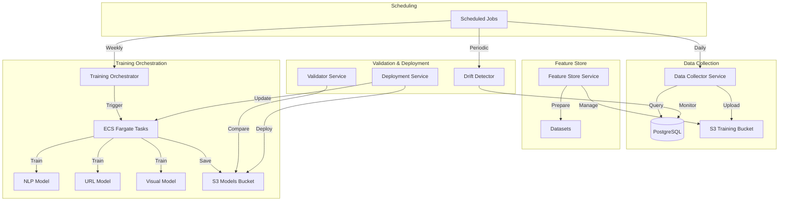

# Phase 8: Complete Learning Pipeline Implementation

## Overview

Build a production-ready automated ML pipeline for incremental learning, model retraining, validation, A/B testing, and drift detection. All components will use real AWS services, database connections, and Python training scripts with full configurability via environment variables.

## Architecture



## Implementation Components

### 1. Core TypeScript Services

**Location**: `backend/core-services/learning-pipeline/src/services/`

#### Data Collector Service (`data-collector.service.ts`)

- Query PostgreSQL for user feedback from `detection_feedback` table
- Collect confirmed threats from `threats` table (status: blocked/resolved)
- Collect false positives from feedback
- Upload collected data to S3 training bucket
- Use TypeORM DataSource for database queries
- Use AWS SDK v3 S3 client
- All S3 bucket names from environment variables

#### Feature Store Service (`feature-store.service.ts`)

- Manage training datasets in S3
- Prepare datasets by aggregating collected data
- Return S3 paths for training jobs
- Track dataset versions and statistics
- Use S3 client for all operations

#### Training Orchestrator Service (`training-orchestrator.service.ts`)

- Trigger ECS Fargate tasks for training
- Support NLP, URL, and Visual model training
- Pass dataset S3 paths as environment variables to tasks
- Track training job status in database (`training_jobs` table)
- Use AWS SDK v3 ECS client
- All ECS cluster/task definitions from environment variables

#### Validator Service (`validator.service.ts`)

- Download models from S3
- Run validation on test datasets
- Calculate metrics: accuracy, precision, recall, F1, FPR, FNR
- Compare new model vs current production model
- Store validation results in database
- Return deployment recommendations

#### Drift Detector Service (`drift-detector.service.ts`)

- Query `model_performance` table for recent metrics
- Compare with historical baseline
- Calculate drift scores
- Detect performance degradation
- Alert when drift threshold exceeded
- Use TypeORM for database queries

#### Deployment Service (`deployment.service.ts`)

- Copy validated models to production S3 location
- Update `ml_models` table (mark as active)
- Support canary, blue-green, rolling deployment strategies
- Trigger ECS service updates to load new models
- Use S3 and ECS clients

### 2. Scheduled Jobs

**Location**: `backend/core-services/learning-pipeline/src/jobs/`

#### Scheduled Training Job (`scheduled-training.job.ts`)

- Daily data collection (1 AM)
- Weekly model training (Sunday 2 AM)
- Run full training pipeline for each model type
- Handle errors and retries
- Log all activities

#### Drift Check Job (`drift-check.job.ts`)

- Periodic drift detection (every 6 hours)
- Check all active models
- Trigger retraining if drift detected

### 3. Python Training Scripts

**Location**: `backend/ml-services/training/`

#### Data Pipeline (`data-pipeline/`)

- `collect_feedback.py`: Download feedback data from S3, format for training
- `prepare_dataset.py`: Aggregate and prepare datasets, handle train/val/test splits
- `feature_extraction.py`: Extract features for each model type

#### NLP Training (`nlp/`)

- `train_phishing_model.py`: Train BERT/RoBERTa model, save to S3
- `train_ai_detector.py`: Train AI-generated content detector
- Use HuggingFace transformers
- Support incremental training from new data
- Upload models and metrics to S3

#### URL Training (`url/`)

- `train_gnn_model.py`: Train Graph Neural Network for URL analysis
- Use PyTorch Geometric
- Process graph features from domain relationships
- Save models to S3

#### Visual Training (`visual/`)

- `train_cnn_model.py`: Train CNN for brand impersonation detection
- Use PyTorch and torchvision
- Process screenshot images
- Save models to S3

#### Validation (`validation/`)

- `evaluate_model.py`: Evaluate model on test set, return metrics
- `compare_models.py`: Compare two model versions side-by-side
- Generate detailed comparison reports

### 4. Main Orchestration Service

**Location**: `backend/core-services/learning-pipeline/src/index.ts`

- Initialize all services with proper dependencies
- Connect to databases (PostgreSQL, MongoDB, Redis)
- Initialize AWS clients (S3, ECS)
- Start scheduled jobs
- Provide health check endpoints
- Handle graceful shutdown

### 5. Configuration & Environment Variables

**New Environment Variables**:

- `ECS_CLUSTER_NAME`: ECS cluster for training tasks
- `ECS_TASK_DEFINITION`: Task definition name
- `ECS_SUBNET_IDS`: Comma-separated subnet IDs
- `ECS_SECURITY_GROUP_IDS`: Comma-separated security group IDs
- `TRAINING_SCHEDULE`: Cron schedule for training (default: `0 2 * * 0`)
- `DATA_COLLECTION_SCHEDULE`: Cron schedule for data collection (default: `0 1 * * *`)
- `DRIFT_CHECK_SCHEDULE`: Cron schedule for drift checks (default: `0 */6 * * *`)
- `DRIFT_THRESHOLD`: F1 score degradation threshold (default: 0.03)
- `MIN_IMPROVEMENT_FOR_DEPLOYMENT`: Minimum F1 improvement to deploy (default: 0.01)
- `MAX_FALSE_POSITIVE_RATE`: Maximum FPR for deployment (default: 0.02)

### 6. Database Integration

- Use TypeORM DataSource from `backend/shared/database/connection.ts`
- Query existing tables: `detections`, `detection_feedback`, `threats`, `model_performance`, `ml_models`, `training_jobs`
- Create new records for training jobs and model versions
- Update model status and deployment information

### 7. AWS Integration

- **S3**: Use AWS SDK v3 `@aws-sdk/client-s3`
  - Training data bucket: `S3_BUCKET_TRAINING`
  - Models bucket: `S3_BUCKET_MODELS`
  - Artifacts bucket: `S3_BUCKET_ARTIFACTS`
- **ECS**: Use AWS SDK v3 `@aws-sdk/client-ecs`
  - Run training tasks on Fargate
  - Pass S3 paths and configuration via environment variables
  - Monitor task status

### 8. Python Dependencies

Add to training scripts:

- `boto3`: AWS SDK for Python
- `pandas`: Data manipulation
- `numpy`: Numerical operations
- `transformers`: HuggingFace models
- `torch`: PyTorch
- `torch-geometric`: GNN support
- `torchvision`: Image processing
- `scikit-learn`: Metrics and evaluation

### 9. Error Handling & Logging

- Comprehensive error handling in all services
- Structured logging with Winston
- Log all training activities, errors, and metrics
- Store training logs in S3 for debugging
- Alert on critical failures

### 10. Testing Considerations

- Unit tests for each service
- Integration tests for data collection
- Mock AWS services for local testing
- Test training scripts with sample data

## File Structure

```
backend/core-services/learning-pipeline/
├── src/
│   ├── index.ts                          # Main orchestration
│   ├── services/
│   │   ├── data-collector.service.ts     # Data collection
│   │   ├── feature-store.service.ts      # Feature store
│   │   ├── training-orchestrator.service.ts  # Training orchestration
│   │   ├── validator.service.ts         # Model validation
│   │   ├── drift-detector.service.ts    # Drift detection
│   │   └── deployment.service.ts        # Model deployment
│   ├── jobs/
│   │   ├── scheduled-training.job.ts    # Scheduled training
│   │   └── drift-check.job.ts            # Drift checks
│   └── utils/
│       ├── logger.ts                     # Logger utility
│       └── metrics.ts                    # Metrics utilities
├── package.json
└── tsconfig.json

backend/ml-services/training/
├── data-pipeline/
│   ├── __init__.py
│   ├── collect_feedback.py              # Collect feedback data
│   ├── prepare_dataset.py              # Dataset preparation
│   └── feature_extraction.py           # Feature extraction
├── nlp/
│   ├── __init__.py
│   ├── train_phishing_model.py         # NLP model training
│   └── train_ai_detector.py            # AI detector training
├── url/
│   ├── __init__.py
│   └── train_gnn_model.py              # GNN model training
├── visual/
│   ├── __init__.py
│   └── train_cnn_model.py              # CNN model training
└── validation/
    ├── __init__.py
    ├── evaluate_model.py                # Model evaluation
    └── compare_models.py                # Model comparison
```

## Key Implementation Details

1. **No Hardcoding**: All values come from environment variables or database
2. **Real AWS Integration**: Use actual AWS SDK clients with proper error handling
3. **Real Database Queries**: Use TypeORM for all database operations
4. **Real Training**: Python scripts that actually train models and save to S3
5. **Production Ready**: Proper error handling, logging, and monitoring
6. **Configurable**: All schedules, thresholds, and settings via environment variables

## Dependencies to Add

**TypeScript** (`backend/core-services/learning-pipeline/package.json`):

- `@aws-sdk/client-s3`
- `@aws-sdk/client-ecs`
- `typeorm`
- `pg` (already present)

**Python** (`backend/ml-services/training/requirements.txt`):

- `boto3>=1.34.0`
- `pandas>=2.0.0`
- `numpy>=1.24.0`
- `transformers>=4.35.0`
- `torch>=2.1.0`
- `torch-geometric>=2.4.0`
- `torchvision>=0.16.0`
- `scikit-learn>=1.3.0`
- `datasets>=2.14.0`

## Implementation Order

1. Set up service structure and dependencies
2. Implement Data Collector Service
3. Implement Feature Store Service
4. Implement Training Orchestrator Service
5. Implement Validator Service
6. Implement Drift Detector Service
7. Implement Deployment Service
8. Create scheduled jobs
9. Create Python training scripts
10. Create Python data pipeline scripts
11. Create Python validation scripts
12. Update main orchestration service
13. Add environment variable documentation
14. Test end-to-end flow