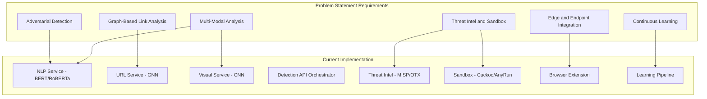

# Real-Time AI/ML Phishing Detection - Problem Statement Aligned Plan

## Problem Statement Mapping

The plan maps each proposed solution component to the current implementation and identifies remaining work to satisfy the problem statement (ID 25159) and expected outcomes.

---

## Architecture Overview

---

## 1. Component-by-Component Gap Analysis

### 1.1 Multi-Modal Data Analysis

| Requirement                | Current State                                                                                                        | Gap                                                        |
| -------------------------- | -------------------------------------------------------------------------------------------------------------------- | ---------------------------------------------------------- |
| **Textual (BERT/RoBERTa)** | PhishingClassifier in [nlp-service](backend/ml-services/nlp-service/src/models/phishing_classifier.py), model loader | No trained weights; needs fine-tuning on phishing datasets |
| **Email body/headers/SMS** | Email parser, header analysis in NLP service                                                                         | No SMS ingestion API or dedicated SMS channel              |
| **Visual (CNNs)**          | CNN classifier, DOM analyzer in [visual-service](backend/ml-services/visual-service/src/models/cnn_classifier.py)    | No trained CNN for brand impersonation                     |
| **DOM/rendering analysis** | dom_analyzer, form_analyzer, logo_detector exist                                                                     | Rule-based; no trained visual similarity model             |

**Action:** Train NLP and Visual models; add SMS input channel to detection API and NLP service.

---

### 1.2 Graph-Based Link and Domain Analysis

| Requirement                      | Current State                                                                                                                                                     | Gap                                                                 |
| -------------------------------- | ----------------------------------------------------------------------------------------------------------------------------------------------------------------- | ------------------------------------------------------------------- |
| **GNN for domain relationships** | [gnn_classifier.py](backend/ml-services/url-service/src/models/gnn_classifier.py), [graph_builder.py](backend/ml-services/url-service/src/graph/graph_builder.py) | No trained GNN; graph features extracted but model returns fallback |
| **WHOIS, SSL, DNS history**      | whois_analyzer, ssl_analyzer, dns_analyzer                                                                                                                        | Implemented                                                         |
| **Link traversal**               | [RedirectTracker](backend/ml-services/url-service/src/crawler/redirect_tracker.py)                                                                                | Implemented; tracks 3xx hops                                        |
| **Domain clustering**            | Graph builder creates domain-URL edges                                                                                                                            | No explicit clustering algorithm; GNN would learn patterns          |

**Action:** Train GNN or use heuristic reputation baseline; ensure redirect/homoglyph signals feed into decision engine (already in [decision-engine.service.ts](backend/core-services/detection-api/src/services/decision-engine.service.ts)).

---

### 1.3 Complex Link Obfuscation (Problem Statement Explicit)

| Requirement                 | Current State                                                                                       | Gap                                                                    |
| --------------------------- | --------------------------------------------------------------------------------------------------- | ---------------------------------------------------------------------- |
| **HTTP 3xx redirect hops**  | RedirectTracker                                                                                     | Done                                                                   |
| **Base64/hex encoding**     | URL parser uses `unquote`                                                                           | No explicit Base64/hex detection or decoding for obfuscation scoring   |
| **URL parameter cloaking**  | Query params parsed in [url_parser.py](backend/ml-services/url-service/src/analyzers/url_parser.py) | No heuristic for suspicious param patterns (e.g., long encoded values) |
| **Homoglyph/typosquatting** | [HomoglyphDetector](backend/ml-services/url-service/src/analyzers/homoglyph_detector.py)            | Implemented                                                            |

**Action:** Add obfuscation analyzer: Base64/hex detection, parameter cloaking heuristics, integrate into URL service and decision engine.

---

### 1.4 Adversarial Detection Layer (Problem Statement Explicit)

| Requirement               | Current State                                                           | Gap                                                          |
| ------------------------- | ----------------------------------------------------------------------- | ------------------------------------------------------------ |
| **AI-generated phishing** | [AIDetector](backend/ml-services/nlp-service/src/models/ai_detector.py) | Structure exists; no trained model                           |
| **LLM embeddings**        | Not present                                                             | Need embedding extractor + classifier for adversarial intent |
| **Adversarial intent**    | Decision engine boosts NLP score when `ai_generated_probability > 0.7`  | Depends on AIDetector output                                 |

**Action:** Train or integrate AI-generated content classifier; optionally add LLM embedding-based anomaly detector for future hardening.

---

### 1.5 Continuous Learning Pipeline

| Requirement                         | Current State                                                                                                                                                                                                            | Gap                                                   |
| ----------------------------------- | ------------------------------------------------------------------------------------------------------------------------------------------------------------------------------------------------------------------------ | ----------------------------------------------------- |
| **Incremental learning from feeds** | [DataCollectorService](backend/core-services/learning-pipeline/src/services/data-collector.service.ts), [FeatureStoreService](backend/core-services/learning-pipeline/src/services/feature-store.service.ts)             | Implemented; depends on S3                            |
| **User feedback**                   | DetectionFeedback model exists                                                                                                                                                                                           | Feedback stored; pipeline must consume for retraining |
| **IOC enrichment**                  | EnrichmentService in threat-intel                                                                                                                                                                                        | Implemented                                           |
| **Automated retraining**            | [ScheduledTrainingJob](backend/core-services/learning-pipeline/src/jobs/scheduled-training.job.ts), [TrainingOrchestratorService](backend/core-services/learning-pipeline/src/services/training-orchestrator.service.ts) | Implemented; triggers ECS training tasks              |
| **Drift prevention**                | [DriftDetectorService](backend/core-services/learning-pipeline/src/services/drift-detector.service.ts), [DriftCheckJob](backend/core-services/learning-pipeline/src/jobs/drift-check.job.ts)                             | Implemented                                           |

**Action:** Connect feedback loop to training pipeline; ensure drift triggers retraining; document data flow.

---

### 1.6 Edge and Endpoint Integration

| Requirement                        | Current State                                                                                  | Gap                                                           |
| ---------------------------------- | ---------------------------------------------------------------------------------------------- | ------------------------------------------------------------- |
| **Browser extensions**             | Chrome, Edge, Firefox in [extensions/](extensions/)                                            | Structure done; blocking UX and email client OAuth incomplete |
| **Sub-50ms latency**               | Extension calls cloud API; no local inference                                                  | Gap: Cloud round-trip adds 50–200ms+                          |
| **Email clients (Outlook, Gmail)** | [EmailClientService](backend/core-services/extension-api/src/services/email-client.service.ts) | Structure exists; OAuth and native integration needed         |
| **Lightweight local inference**    | Not implemented                                                                                | Problem statement specifies "real-time local inference"       |

**Action:** For MVP, optimize cloud path (caching, parallel calls) to approach sub-100ms. For long-term, evaluate local inference (e.g., ONNX in extension) or edge deployment.

---

### 1.7 Threat Intelligence and Sandbox

| Requirement                   | Current State                                     | Gap                                                                                                             |
| ----------------------------- | ------------------------------------------------- | --------------------------------------------------------------------------------------------------------------- |
| **MISP, AlienVault OTX**      | FeedManager, SyncService                          | Implemented; needs API keys                                                                                     |
| **Behavioral sandbox**        | Cuckoo, Any.run clients                           | Implemented; needs sandbox credentials                                                                          |
| **Bidirectional integration** | IOC sync into system; correlation with detections | Implemented via [CorrelationService](backend/core-services/sandbox-service/src/services/correlation.service.ts) |

**Action:** Document API key setup; provide optional mock/sample mode for development.

---

## 2. Expected Outcomes vs Current State

| Outcome                    | Target               | Current                               | Gap                                   |
| -------------------------- | -------------------- | ------------------------------------- | ------------------------------------- |
| **Detection accuracy**     | 95% TPR, &lt;2% FPR  | Not measurable (no models)            | Need benchmarks, validation pipeline  |
| **Zero-day readiness**     | Adaptive pipelines   | Learning pipeline exists              | Need data ingestion + retraining loop |
| **Scalability**            | Cloud-native         | ECS, Terraform, microservices         | Largely met                           |
| **Operational efficiency** | &lt;100ms latency    | Not measured; cloud calls add latency | Add latency metrics; optimize         |
| **Cross-sector**           | SMB, enterprise, gov | Architecture supports multi-tenant    | Documentation and config profiles     |

---

## 3. Phased Implementation Plan

### Phase 1: Model Training and Detection Core (3–4 weeks)

**Objective:** Enable meaningful detection and meet baseline accuracy targets.

1. **NLP Phishing Model**
  - Dataset: PhishIntention, SOREB-Phish, or custom labeled corpus
  - Fine-tune BERT/RoBERTa for binary classification (phishing vs legitimate)
  - Save to `nlp-service/models/` or S3; update [model_loader](backend/ml-services/nlp-service/src/models/model_loader.py)
  - Target: 90%+ accuracy on holdout set
2. **AI-Generated Content Detector (Adversarial Layer)**
  - Use public detector (e.g., GPT-2 output detector) or train lightweight classifier
  - Integrate into [AIDetector](backend/ml-services/nlp-service/src/models/ai_detector.py)
  - Wire output into decision engine (already boosted in [decision-engine.service.ts](backend/core-services/detection-api/src/services/decision-engine.service.ts))
3. **URL Service Baseline**
  - Option A: Heuristic ensemble (redirect count, homoglyph score, WHOIS/DNS suspicious flags) in reputation scorer
  - Option B: Train GNN if graph dataset available
  - Ensure [decision-engine](backend/core-services/detection-api/src/services/decision-engine.service.ts) uses URL signals correctly
4. **Obfuscation Analyzer**
  - New module in url-service: `obfuscation_analyzer.py`
  - Detect Base64/hex in path/query; suspicious parameter patterns
  - Expose `is_suspicious` in URL analysis; feed into decision engine
5. **Validation Framework**
  - Script to run detections on labeled test set
  - Report TPR, FPR, precision, recall, F1
  - Store in ModelPerformance for drift tracking

**Deliverables:** Trained NLP + optional AI detector; URL heuristic/obfuscation; validation script; documented model paths.

---

### Phase 2: Latency, SMS, and Endpoint Polish (2–3 weeks)

**Objective:** Approach sub-100ms latency; add SMS channel; improve extension UX.

1. **Latency Optimization**
  - Add timing middleware; log p50/p95/p99 per endpoint
  - Aggressive caching for repeated URLs (Redis TTL tuning)
  - Parallel ML calls (already done); ensure no serial bottlenecks
  - Target: p95 &lt;100ms for URL/text detection
2. **SMS Support**
  - New detection route: `POST /api/v1/detect/sms`
  - Reuse NLP pipeline (text analysis); no header parsing
  - Document in API; add to extension if SMS capture possible (platform-dependent)
3. **Extension: Threat Blocking**
  - Intercept navigation for confirmed threats (webRequest blocking)
  - Warning page instead of silent redirect
  - Update [background.js](extensions/chrome/background.js) and content script
4. **Extension: Gmail/Outlook**
  - OAuth flow for Gmail API, Microsoft Graph
  - Scan inbound emails; surface warnings in UI
  - Depends on [email-client.service](backend/core-services/extension-api/src/services/email-client.service.ts)
5. **Visual Model (Optional)**
  - Train lightweight CNN on brand impersonation / login form screenshots
  - Or use rule-based DOM signals as fallback

**Deliverables:** Latency metrics; SMS detection route; blocking UX; OAuth scaffolding for email clients.

---

### Phase 3: Zero-Day Readiness and Continuous Learning (2–3 weeks)

**Objective:** Close the feedback loop; enable drift-triggered retraining.

1. **Feedback Pipeline**
  - Ensure `DetectionFeedback` entries are consumed by [DataCollectorService](backend/core-services/learning-pipeline/src/services/data-collector.service.ts)
  - Export feedback + threat intel IOCs to feature store (S3)
  - Training job consumes exported data
2. **Drift-Triggered Retraining**
  - When [DriftDetectorService](backend/core-services/learning-pipeline/src/services/drift-detector.service.ts) reports drift above threshold, invoke TrainingOrchestrator
  - Add workflow: drift check → collect new data → retrain → validate → deploy
3. **Threat Feed Integration**
  - Document MISP/OTX/PhishTank setup
  - Add sample/mock mode for CI and dev
  - Ensure new IOCs flow into Bloom filter and sync scheduler
4. **Red-Team Simulation**
  - Create test harness: inject known phishing samples; measure detection rate
  - Integrate into validation framework from Phase 1

**Deliverables:** Feedback-to-training pipeline; drift-triggered retraining; red-team harness; feed documentation.

---

### Phase 4: Production Hardening and Cross-Sector Readiness (2 weeks)

**Objective:** Meet production and compliance expectations.

1. **Accuracy Validation**
  - Run full benchmark on large dataset
  - Target: 95% TPR, &lt;2% FPR; tune thresholds if needed
  - Store results for compliance/audit
2. **Monitoring and Alerting**
  - CloudWatch dashboards per service
  - Alerts on drift, high error rate, latency degradation
  - Log aggregation and retention
3. **Documentation**
  - Deployment runbook (env vars, secrets, scaling)
  - API documentation (OpenAPI/Swagger)
  - Cross-sector config profiles (SMB, enterprise, gov)
4. **Security Review**
  - Auth (API keys, extension auth)
  - Secrets management (no keys in code)
  - CORS, rate limits, input validation
5. **Local Inference (Optional, Future)**
  - Evaluate ONNX runtime in extension for cached/simple checks
  - Or edge deployment (CloudFront + Lambda) for lower latency regions

**Deliverables:** Validated accuracy; monitoring; runbook; API docs; security checklist.

---

## 4. Key Files to Modify

| Phase | Files                                                                                                                                                                                                                                    |
| ----- | ---------------------------------------------------------------------------------------------------------------------------------------------------------------------------------------------------------------------------------------- |
| 1     | `backend/ml-services/nlp-service/models/` (add weights), `model_loader.py`, `backend/ml-services/url-service/src/analyzers/obfuscation_analyzer.py` (new), `backend/core-services/detection-api/src/services/decision-engine.service.ts` |
| 2     | `backend/core-services/detection-api/src/routes/detection.routes.ts` (SMS route), `extensions/chrome/background.js`, `content.js`, `lib/api-client.ts`                                                                                   |
| 3     | `backend/core-services/learning-pipeline/src/services/data-collector.service.ts`, `backend/core-services/learning-pipeline/src/jobs/drift-check.job.ts`, threat-intel sync scripts                                                       |
| 4     | `backend/infrastructure/terraform/modules/`, `.github/workflows/`, docs                                                                                                                                                                  |

---

## 5. Dependencies and Blockers

- **Datasets:** Phishing corpora (PhishIntention, SOREB-Phish, etc.) for NLP training
- **API Keys:** MISP, OTX, PhishTank, VirusTotal, Cuckoo/Any.run for full threat intel and sandbox
- **AWS:** S3, ECS for learning pipeline; optional for local dev with mock
- **OAuth:** Gmail/Outlook developer credentials for email client integration

---

## 6. Success Criteria (Problem Statement Alignment)

- 95%+ TPR, &lt;2% FPR on validation set
- p95 detection latency &lt;100ms (cloud path)
- Zero-day: drift detection + retraining pipeline active
- Browser extensions (Chrome, Firefox, Edge) with blocking
- SMS detection route available
- MISP/OTX integration documented and optionally enabled
- Red-team simulation passing
- Deployment runbook and API docs published

