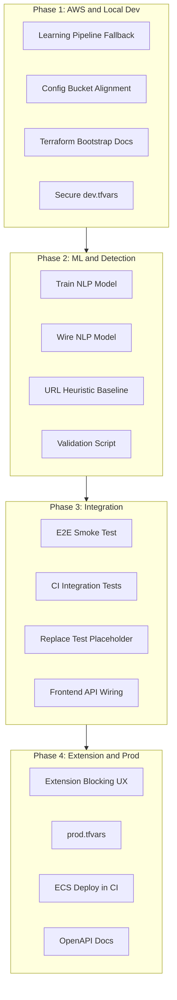

# Remaining Changes Implementation Plan

## Current State Summary

The project is ~72% complete. Main gaps: **AWS not configured**, **no trained ML models**, **learning pipeline fails without AWS**, **CI/CD has placeholders**, **integration/E2E tests missing**.

---

## Phase 1: AWS and Local Development Setup (Priority: P0)

**Goal:** Enable the system to run locally without failing, and prepare AWS for production.

### 1.1 Learning Pipeline AWS Fallback

The learning-pipeline service crashes on startup because it always initializes S3/ECS clients with no credentials check.

**File:** [backend/core-services/learning-pipeline/src/index.ts](backend/core-services/learning-pipeline/src/index.ts)

- Add env check: `AWS_ENABLED` or presence of `AWS_ACCESS_KEY_ID`
- If AWS not configured: skip S3/ECS init, run drift detector only (DB-backed), log "Learning pipeline running in local mode - S3/ECS disabled"
- Conditionally initialize `DataCollectorService`, `FeatureStoreService`, `TrainingOrchestratorService`, `ValidatorService`, `DeploymentService` only when AWS credentials exist
- Make `ScheduledTrainingJob` no-op when AWS disabled; keep `DriftCheckJob` active (uses DB only)

### 1.2 Align Config with Terraform S3 Bucket Names

**File:** [backend/shared/config/index.ts](backend/shared/config/index.ts)

Current default `phishing-detection-training-dev` does not match Terraform S3 module output `phishing-detection-training-data-${env}`.

- Update default for training bucket: `phishing-detection-training-data-dev` (or add `S3_BUCKET_TRAINING_DATA` and document Terraform output mapping)
- Update [backend/.env.example](backend/.env.example) and [backend/env.template](backend/env.template) to use `phishing-detection-training-data-dev`

### 1.3 Terraform Backend Bootstrap Script / Docs

**New file:** `backend/infrastructure/terraform/BOOTSTRAP.md`

Document one-time manual steps:

1. Create S3 bucket `phishing-detection-terraform-state-1768755350` in `ap-south-1`
2. Create DynamoDB table `terraform-state-lock` with partition key `LockID` (String)
3. Ensure `AWS_ACCESS_KEY_ID` and `AWS_SECRET_ACCESS_KEY` are set

### 1.4 Secure dev.tfvars

**File:** [backend/infrastructure/terraform/environments/dev.tfvars](backend/infrastructure/terraform/environments/dev.tfvars)

- Remove `db_password` from committed file; use `TF_VAR_db_password` from environment or `-var="db_password=..."` at runtime
- Add `dev.tfvars.example` with placeholder; document in BOOTSTRAP.md

### 1.5 GitHub Secrets Documentation

**File:** [docs/DEPLOYMENT_RUNBOOK.md](docs/DEPLOYMENT_RUNBOOK.md)

Add section listing required GitHub repo secrets:

- `AWS_ACCESS_KEY_ID`, `AWS_SECRET_ACCESS_KEY`, `AWS_ACCOUNT_ID`
- `TF_VAR_DB_PASSWORD`, `TF_VAR_DB_PASSWORD_PROD`

---

## Phase 2: ML Models and Detection Core (Priority: P0)

**Goal:** Enable meaningful phishing detection with at least one trained model.

### 2.1 Train NLP Phishing Model

**Files:** [backend/ml-services/nlp-service/scripts/train_phishing_model.py](backend/ml-services/nlp-service/scripts/train_phishing_model.py)

- Verify training script works with a public dataset (e.g., PhishIntention, SOREB-Phish, or create minimal labeled corpus)
- Add `requirements-datasets.txt` or document dataset download steps in script
- Output model to `models/phishing-detector` (or `MODEL_DIR`)
- Add `README.md` in `scripts/` with dataset links and training command

### 2.2 Wire NLP Model into Service

**File:** [backend/ml-services/nlp-service/src/models/model_loader.py](backend/ml-services/nlp-service/src/models/model_loader.py)

- Ensure loader correctly loads trained weights from `models/phishing-detector`
- Verify fallback behavior when no model exists (already in place per analysis)

### 2.3 URL Service Heuristic Baseline (No GNN Training)

**File:** [backend/ml-services/url-service/src/api/routes.py](backend/ml-services/url-service/src/api/routes.py) and analyzers

- Obfuscation analyzer exists ([obfuscation_analyzer.py](backend/ml-services/url-service/src/analyzers/obfuscation_analyzer.py)); ensure it is integrated into URL analysis pipeline
- Strengthen heuristic reputation scoring (redirect count, homoglyph score, obfuscation flags) so URL service returns useful signals without trained GNN
- Ensure [decision-engine.service.ts](backend/core-services/detection-api/src/services/decision-engine.service.ts) uses URL `is_suspicious` / obfuscation signals

### 2.4 Validation Script

**File:** [backend/ml-services/nlp-service/scripts/validate_models.py](backend/ml-services/nlp-service/scripts/validate_models.py)

- Extend with more test cases and TPR/FPR reporting
- Add script to run via detection API on labeled test set; output metrics to stdout for CI

---

## Phase 3: Integration and E2E (Priority: P1)

### 3.1 E2E Smoke Test

**New file:** `backend/tests/e2e/smoke.test.ts` (or `scripts/smoke-test.sh`)

- Start stack via `docker-compose up -d` (or use testcontainers)
- Call `POST /api/v1/detect/url` with known safe and known phishing URL
- Assert response structure and threat level
- Document in runbook: `npm run smoke` or `./scripts/smoke-test.sh`

### 3.2 Fix CI Integration Test Step

**File:** [.github/workflows/backend-ci.yml](.github/workflows/backend-ci.yml)

- Replace `echo "Integration tests would run here"` with actual command, e.g. `npm run test:integration` from `backend/tests/`
- Make smoke test runnable in CI (Docker-based or mocked APIs)

### 3.3 Replace Test Placeholder

**File:** [.github/workflows/backend-ci.yml](.github/workflows/backend-ci.yml) (lint-and-test job)

- Change `npm test || echo "Tests not yet implemented"` to `npm test` so jobs fail when tests exist but are broken
- Add minimal unit tests for critical paths (e.g., decision engine) if none exist

### 3.4 Frontend API Wiring

**Files:** Frontend API client, `.env.local`

- Ensure `NEXT_PUBLIC_API_URL` (or equivalent) points to backend
- Add API key configuration in Settings page; persist in localStorage
- Fix any CORS or base URL mismatches for local dev

---

## Phase 4: Extension and Production Readiness (Priority: P2)

### 4.1 Extension Threat Blocking UX

**Files:** [extensions/chrome/background.js](extensions/chrome/background.js), content script, [extensions/chrome/blocked.html](extensions/chrome/blocked.html)

- Use `webRequest` / `declarativeNetRequest` to block navigation for confirmed phishing URLs
- Show warning/blocked page ([blocked.html](extensions/chrome/blocked.html)) instead of loading the site
- Wire badge color to threat level; add "Report false positive" flow

### 4.2 Create prod.tfvars

**File:** `backend/infrastructure/terraform/environments/prod.tfvars`

- Copy from [prod.tfvars.example](backend/infrastructure/terraform/environments/prod.tfvars.example); document that sensitive vars come from GitHub secrets

### 4.3 ECS Deploy Step in CI

**File:** [.github/workflows/backend-ci.yml](.github/workflows/backend-ci.yml)

- Uncomment and fix `aws ecs update-service` for deploy-dev and deploy-prod
- Use correct cluster name and service names from Terraform outputs

### 4.4 OpenAPI / API Documentation

- Add OpenAPI (Swagger) spec for detection-api, extension-api, threat-intel
- Serve `/api-docs` or similar; document in [docs/API_REFERENCE.md](docs/API_REFERENCE.md)

---

## Phase 5: Optional Enhancements (Priority: P3)

- SMS detection route: `POST /api/v1/detect/sms`
- WebSocket real-time monitor in frontend
- Visual service model training (or rule-based DOM fallback)
- Learning pipeline: connect feedback loop to training

---

## Dependency Graph

---

## Estimated Effort

| Phase | Focus                      | Effort   |
| ----- | -------------------------- | -------- |
| 1     | AWS setup + local fallback | 2-3 days |
| 2     | ML models + URL heuristics | 4-6 days |
| 3     | Integration + E2E          | 2-3 days |
| 4     | Extension + production     | 2-3 days |
| 5     | Optional                   | Ongoing  |

**Total for MVP-ready:** ~10-15 days