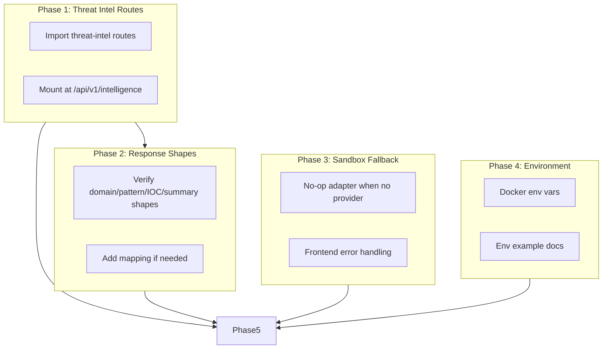

# Remaining Services Integration Plan

## Overview

This plan covers the completion of frontend–backend integration, remaining service connections, and end-to-end functionality gaps identified from a full codebase analysis.

---

## Current State Summary

### Frontend (Next.js)

| Page | Components | API Integration | Status |
|------|------------|-----------------|--------|
| `/` (Dashboard) | ThreatDashboard, ThreatChart, RecentThreats | `getDashboardStats`, `getThreatDistribution`, `getChartData`, `getRecentThreats` | ✅ Working (if APIs available) |
| `/detection` | URLDetector, EmailDetector, TextDetector | `detectURL`, `detectEmail`, `detectText` | ✅ Working |
| `/iocs` | IOCChecker, IOCBulkChecker, IOCSearch, IOCReporter, IOCStats | `checkIOC`, `bulkCheckIOC`, `searchIOCs`, `reportIOC`, `getIOCStats` | ✅ Working |
| `/feeds` | FeedList, FeedForm, FeedStatus | `listFeeds`, `createFeed`, `updateFeed`, `deleteFeed`, `syncAllFeeds` | ✅ Working |
| `/intelligence` | ThreatIntelligence | `getMaliciousDomains`, `getThreatPatterns`, `getIOCs`, `getThreatIntelligenceSummary` | ❌ **Broken** – endpoints not mounted |
| `/monitoring` | RealtimeMonitor | WebSocket `threat_detected`, `url_analyzed`, `email_analyzed` | ✅ Working |
| `/sandbox` | SandboxSubmit, AnalysisStatus, SandboxResults, SandboxList | `submitFileForAnalysis`, `submitURLForAnalysis`, `getSandboxAnalysis`, `listSandboxAnalyses` | ⚠️ Partial – requires sandbox providers |
| `/settings` | ApiSettings, ThemeSettings, NotificationSettings | localStorage `api_key`, `api_url`, `ws_url` | ✅ Working |

### Backend API Endpoints

| Frontend Call | Backend Endpoint | Gateway Route | Backend Status |
|---------------|------------------|---------------|----------------|
| `getDashboardStats()` | `GET /api/v1/dashboard/stats` | detection-api | ✅ Exists |
| `getRecentThreats()` | `GET /api/v1/dashboard/threats` | detection-api | ✅ Exists |
| `getChartData()` | `GET /api/v1/dashboard/chart` | detection-api | ✅ Exists |
| `getThreatDistribution()` | `GET /api/v1/dashboard/distribution` | detection-api | ✅ Exists |
| `detectURL/Email/Text` | `POST /api/v1/detect/*` | detection-api | ✅ Exists |
| `getMaliciousDomains()` | `GET /api/v1/intelligence/domains` | threat-intel | ❌ **Not mounted** |
| `getThreatPatterns()` | `GET /api/v1/intelligence/patterns` | threat-intel | ❌ **Not mounted** |
| `getIOCs()` | `GET /api/v1/intelligence/iocs` | threat-intel | ❌ **Not mounted** |
| `getThreatIntelligenceSummary()` | `GET /api/v1/intelligence/summary` | threat-intel | ❌ **Not mounted** |
| IOC CRUD | `POST/GET /api/v1/ioc/*` | threat-intel | ✅ Exists |
| Feeds CRUD | `GET/POST/PUT/DELETE /api/v1/feeds/*` | threat-intel | ✅ Exists |
| Sandbox | `POST /api/v1/sandbox/analyze/*`, `GET /api/v1/sandbox/analysis/*` | sandbox-service | ✅ Exists |
| WebSocket | `io()` via `/socket.io` | detection-api (proxied) | ✅ Exists |

---

## Gap Analysis

### 1. Threat Intelligence – Domains, Patterns, IOCs, Summary (Critical)

**Problem:** `threat-intel.routes.ts` defines `GET /domains`, `/patterns`, `/iocs`, `/summary` but is **never mounted** in `threat-intel/src/index.ts`. Only `intelligence.routes.ts` (check/url, check/domain, stats, feeds/sync) is mounted at `/api/v1/intelligence`.

**File:** `backend/core-services/threat-intel/src/index.ts`

**Fix:** Import and mount `threat-intel.routes.ts` at `/api/v1/intelligence`:

```typescript
import threatIntelRoutes from './routes/threat-intel.routes';
// ...
app.use('/api/v1/intelligence', threatIntelRoutes);  // Add before or merge with intelligenceRoutes
```

**Note:** `intelligence.routes` and `threat-intel.routes` both use `/api/v1/intelligence`. They have different sub-paths:
- `intelligence.routes`: `/check/url`, `/check/domain`, `/check/ip`, `/feeds/sync`, `/stats`, `/feeds/status`
- `threat-intel.routes`: `/domains`, `/iocs`, `/patterns`, `/summary`

No path overlap. Mount both under the same prefix:

```typescript
app.use('/api/v1/intelligence', intelligenceRoutes);
app.use('/api/v1/intelligence', threatIntelRoutes);
```

### 2. Threat Intel Routes – Auth and Response Shape

**Problem:** `threat-intel.routes.ts` may lack auth middleware. Frontend types expect specific shapes.

**Checks:**
- Add `authMiddleware` to domains, patterns, iocs, summary if other intelligence routes use it
- Ensure response shapes match `lib/types/api.ts`:
  - `MaliciousDomain`: `{ domain, reputation, reports, firstSeen?, lastSeen? }`
  - `ThreatPattern`: `{ pattern, incidents, severity? }`
  - `IOC`: `{ value, type, sources, firstSeen?, lastSeen?, severity? }`
  - `ThreatIntelligenceSummary`: `{ knownThreats, feedIntegrations, zeroDayDetection, lastUpdated }`

### 3. Sandbox Service – Provider Fallback (Medium)

**Problem:** Sandbox requires Cuckoo or Any.run. Without keys, the service fails to start.

**File:** `backend/core-services/sandbox-service/src/index.ts`

**Fix:** Add a fallback when no provider is configured:
- Start service with a “disabled” adapter that returns `503` or a clear error for analyze requests
- Or document that sandbox is optional and must be excluded from minimal profile (already done)

### 4. API Gateway – Sandbox and Extension Proxying

**Status:** Gateway routes `/api/v1/sandbox` → sandbox-service and `/api/v1/extension` → extension-api. ✅ Configured.

### 5. Frontend Environment and Runtime Config

**Current:**
- `NEXT_PUBLIC_API_URL` (build-time)
- `NEXT_PUBLIC_WS_URL` (build-time)
- `localStorage`: `api_key`, `api_url`, `ws_url` (runtime override)

**Gap:** Root `docker-compose` frontend may not receive correct `NEXT_PUBLIC_*` for container networking.

**Check:** `docker-compose.yml` frontend build args:
- `NEXT_PUBLIC_API_URL`: use API gateway URL (e.g. `http://api-gateway:3000` for backend, or external URL for browser)
- For browser clients, URL must be reachable from the user (localhost or public host)

### 6. Frontend CI – E2E / Integration Tests

**Current:** `frontend-ci.yml` only runs `npm run build`.

**Optional:** Add frontend E2E tests (Playwright/Cypress) against a running stack.

---

## Implementation Phases

### Phase 1: Mount Threat Intelligence Routes (Critical, ~30 min)

| Task | File | Action |
|------|------|--------|
| 1.1 | `backend/core-services/threat-intel/src/index.ts` | Import `threatIntelRoutes` from `./routes/threat-intel.routes` |
| 1.2 | `backend/core-services/threat-intel/src/index.ts` | Add `app.use('/api/v1/intelligence', threatIntelRoutes)` |
| 1.3 | Verify | Ensure no route path conflicts with `intelligence.routes` |
| 1.4 | Optional | Add auth to threat-intel routes if required by policy |

### Phase 2: Response Shape and Type Alignment (Low, ~20 min)

| Task | File | Action |
|------|------|--------|
| 2.1 | `threat-intel.routes.ts` | Ensure domains use `domain`, `reputation`, `reports`, `firstSeen`, `lastSeen` |
| 2.2 | `threat-intel.routes.ts` | Ensure IOCs use `value`, `type`, `sources`, `firstSeen`, `lastSeen` |
| 2.3 | `lib/types/api.ts` vs backend | Add mapping in frontend if backend uses different field names |

### Phase 3: Sandbox Service Resilience (Optional, ~45 min)

| Task | File | Action |
|------|------|--------|
| 3.1 | `sandbox-service/src/index.ts` | Add “no-op” or disabled adapter when CUCKOO/ANYRUN not configured |
| 3.2 | Sandbox routes | Return `503` or structured error when sandbox is disabled |
| 3.3 | Frontend sandbox components | Handle disabled state with user message |

### Phase 4: Docker and Environment Verification (~15 min)

| Task | File | Action |
|------|------|--------|
| 4.1 | Root `docker-compose.yml` | Confirm frontend `NEXT_PUBLIC_API_URL` and `NEXT_PUBLIC_WS_URL` for browser access |
| 4.2 | `.env.example` | Add `NEXT_PUBLIC_API_URL`, `NEXT_PUBLIC_WS_URL`, `NEXT_PUBLIC_WS_URL` |
| 4.3 | README | Document env vars for local and Docker runs |

### Phase 5: End-to-End Verification

| Test | Expected Result |
|------|-----------------|
| Dashboard | Stats, chart, recent threats, distribution load from APIs |
| Detection | URL/email/text detection returns results |
| IOCs | Check, bulk check, search, report work |
| Feeds | List, add, edit, delete, sync work |
| Intelligence | Domains, patterns, IOCs, summary tabs load |
| Monitoring | WebSocket connects, events appear |
| Sandbox | Submit file/URL, status polling, results display |
| Settings | API key, URLs persist and apply to requests |

---

## Dependency Flow



---

## Quick Reference – Key Paths

| Area | Path |
|------|------|
| Threat intel routes (unmounted) | `backend/core-services/threat-intel/src/routes/threat-intel.routes.ts` |
| Threat intel index | `backend/core-services/threat-intel/src/index.ts` |
| Frontend threat intel API | `lib/api/threat-intel.ts` |
| Frontend types | `lib/types/api.ts` |
| API client | `lib/api-client.ts` |
| WebSocket hook | `hooks/use-websocket.ts` |
| Root docker-compose | `docker-compose.yml` |
| Backend docker-compose | `backend/docker-compose.yml` |
| API gateway config | `backend/api-gateway/src/config/gateway.ts` |

---

## Priority Order

1. **Phase 1** – Mount threat-intel routes (unblocks Intelligence page)
2. **Phase 2** – Response shape checks (polish)
3. **Phase 4** – Docker/env verification (deployability)
4. **Phase 3** – Sandbox fallback (optional resilience)
