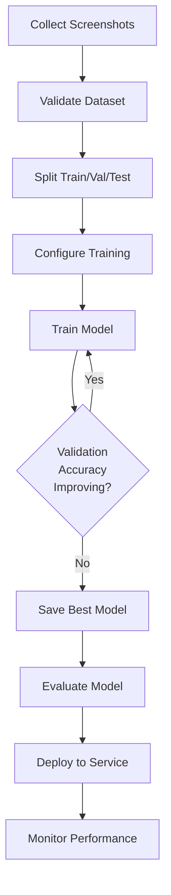

# Visual CNN Model Training Plan

## Overview

Complete training workflow for the CNN brand impersonation classifier, from dataset collection to model deployment.

## Phase 1: Dataset Preparation

### 1.1 Dataset Collection Strategy

**Target Brands**: Focus on commonly impersonated brands

- Financial: PayPal, Bank of America, Chase, Wells Fargo
- Tech: Microsoft, Apple, Google, Amazon
- Social: Facebook, LinkedIn, Twitter
- E-commerce: eBay, Amazon, Shopify
- Others: Netflix, Adobe, Dropbox

**Data Sources**:

1. **Legitimate Brand Websites**: Screenshot official brand websites
2. **Phishing Archive**: Use phishing datasets with screenshots (PhishTank, OpenPhish)
3. **Web Scraping**: Use Playwright to capture legitimate brand pages
4. **Public Datasets**: Look for brand impersonation datasets

### 1.2 Dataset Structure

Create directory structure:

```
data/
  raw/                    # Raw screenshots
    paypal/
      screenshot_001.png
      screenshot_002.png
    microsoft/
      screenshot_001.png
  processed/              # Processed/cleaned images
    paypal/
      ...
  train/                  # Training split (80%)
    paypal/
    microsoft/
  val/                    # Validation split (20%)
    paypal/
    microsoft/
```

### 1.3 Dataset Requirements (50 Images Plan)

- **Target**: 50 images per brand (quick test/development scenario)
- **Number of Brands**: 5-10 brands (250-500 total images)
- **Image Format**: PNG or JPEG
- **Image Size**: 1920x1080 or similar (will be resized to 224x224)
- **Balance**: Roughly equal distribution (50 images per brand)
- **Quality**: Clear, readable screenshots (no blur, proper lighting)
- **Use Case**: Development/testing, workflow validation, quick model training

### 1.4 Dataset Collection Script

Create `training/collect_dataset.py`:

- Use existing `PageRenderer` to capture screenshots
- Batch process URLs from brand lists
- Save screenshots with consistent naming
- Validate image quality
- Generate dataset statistics

## Phase 2: Dataset Validation & Preprocessing

### 2.1 Data Quality Checks

Create `training/validate_dataset.py`:

- Check image file integrity
- Verify image dimensions
- Detect corrupted images
- Check class balance
- Generate dataset statistics report

### 2.2 Data Augmentation

Enhance `training/train_cnn_model.py` with:

- Additional augmentation options (already has some)
- Consider: random crops, perspective transforms, noise injection
- Augmentation should match real-world variations

### 2.3 Train/Val/Test Split

Update training script to support:

- Stratified split (maintain class balance)
- Configurable split ratios (default: 80/20 train/val)
- Optional test set (60/20/20 split)

## Phase 3: Training Configuration

### 3.1 Training Parameters

**50 Images Plan Configuration** (quick testing with 50 images per brand):

- Epochs: 10-15 (may need more with small dataset)
- Batch size: 16-32 (adjust based on GPU memory)
- Learning rate: 0.001 (can reduce to 0.0005 if overfitting)
- Optimizer: Adam
- Loss: NLLLoss (for log_softmax output)
- Early stopping: Stop if no improvement for 3-5 epochs
- Data augmentation: More aggressive (to compensate for small dataset)

**Production Configuration**:

- Epochs: 20-30
- Batch size: 64 (if GPU memory allows)
- Learning rate: 0.0001 (with scheduler)
- Optimizer: Adam with weight decay
- Early stopping: Stop if no improvement for 5 epochs

### 3.2 Training Enhancements

Enhance `training/train_cnn_model.py`:

- Add learning rate scheduler (ReduceLROnPlateau)
- Add early stopping callback
- Add model checkpointing (save every N epochs)
- Add TensorBoard logging
- Add training progress visualization
- Add mixed precision training (if GPU supports)

### 3.3 Hardware Requirements

- **Minimum**: CPU (slow, 6-16 hours for medium dataset)
- **Recommended**: GPU with 8GB+ VRAM (NVIDIA RTX 2060 or better)
- **Optimal**: GPU with 16GB+ VRAM (NVIDIA RTX 3080/3090 or A100)

## Phase 4: Training Execution

### 4.1 Pre-Training Checklist

- [ ] Dataset collected and validated
- [ ] Dataset structure matches expected format
- [ ] GPU/CPU available and configured
- [ ] Training script tested with small dataset
- [ ] Output directory created
- [ ] Sufficient disk space for model checkpoints

### 4.2 Training Commands

**50 Images Plan Training Command**:

```bash
python training/train_cnn_model.py \
  --data-dir ./data \
  --output-dir ./models/cnn-brand-classifier-v1 \
  --epochs 15 \
  --batch-size 16 \
  --learning-rate 0.001 \
  --device auto
```

**Note**: With 50 images per brand:

- Training set: ~40 images per brand (80% split)
- Validation set: ~10 images per brand (20% split)
- Total training samples: ~200-400 images (for 5-10 brands)
- Expected training time: 30-60 minutes (GPU) or 2-4 hours (CPU)

**Production Training**:

```bash
python training/train_cnn_model.py \
  --data-dir ./data/train \
  --output-dir ./models/cnn-brand-classifier-v1 \
  --epochs 20 \
  --batch-size 32 \
  --learning-rate 0.0001 \
  --device cuda
```

### 4.3 Training Monitoring

- Monitor training/validation loss
- Monitor training/validation accuracy
- Watch for overfitting (train acc >> val acc)
- Track best model checkpoint
- Monitor GPU/CPU usage

## Phase 5: Model Evaluation

### 5.1 Evaluation Metrics

Create `training/evaluate_model.py`:

- Accuracy (overall and per-class)
- Precision, Recall, F1-score (per brand)
- Confusion matrix
- Top-K accuracy (top 3, top 5 predictions)
- Inference latency testing

### 5.2 Model Testing

- Test on held-out test set (if created)
- Test on real-world phishing examples
- Test inference speed (CPU vs GPU)
- Test model size and memory usage

### 5.3 Model Comparison

- Compare trained model vs untrained baseline
- Compare different training configurations
- A/B test different model architectures (if needed)

## Phase 6: Model Deployment

### 6.1 Model Files

After training, verify:

- `models/cnn-brand-classifier-v1/model.pt` exists
- `models/cnn-brand-classifier-v1/brand_mapping.json` exists
- Model file size is reasonable (< 500MB for ResNet50)

### 6.2 Service Integration

- Update `CNN_MODEL_PATH` environment variable
- Restart visual service
- Verify model loads correctly
- Test API endpoints with trained model

### 6.3 Performance Validation

- Test inference latency
- Test accuracy on sample URLs
- Monitor service logs for errors
- Compare results with rule-based fallback

## Files to Create/Enhance

1. **`training/collect_dataset.py`** (NEW)

   - Script to collect screenshots from brand URLs
   - Batch processing with PageRenderer
   - Dataset organization

2. **`training/validate_dataset.py`** (NEW)

   - Dataset quality checks
   - Statistics generation
   - Data validation

3. **`training/evaluate_model.py`** (NEW)

   - Model evaluation metrics
   - Confusion matrix generation
   - Performance testing

4. **`training/config.py`** (NEW)

   - Training configuration constants
   - Hyperparameter defaults
   - Path configurations

5. **`training/train_cnn_model.py`** (ENHANCE)

   - Add learning rate scheduler
   - Add early stopping
   - Add TensorBoard logging
   - Add checkpoint saving
   - Add test set support

6. **`training/README.md`** (NEW)

   - Training workflow documentation
   - Dataset preparation guide
   - Troubleshooting guide

## Training Workflow Diagram



## Estimated Timeline (50 Images Plan)

- **Dataset Collection**: 4-8 hours (manual) or 1-2 days (automated scraping)
  - 50 images × 5-10 brands = 250-500 screenshots
  - ~5-10 minutes per brand if automated
- **Dataset Validation**: 1-2 hours
- **Training**: 30-60 minutes (GPU) or 2-4 hours (CPU)
  - Small dataset (250-500 images) trains quickly
- **Evaluation**: 1 hour
- **Deployment**: 30 minutes

**Total**: 1-2 days for complete workflow (50 images plan)

## Success Criteria (50 Images Plan)

**Realistic Expectations for 50 Images per Brand**:

- Validation accuracy: 60-75% (acceptable for small dataset)
- Training accuracy may be higher (watch for overfitting)
- Inference latency < 200ms on GPU, < 1s on CPU
- Model correctly identifies top 3 brands with > 50% confidence
- Service successfully loads and uses trained model
- Model demonstrates learning (better than random chance)

**Note**: With only 50 images per brand, expect:

- Lower accuracy than production model (which needs 200+ images)
- Higher variance in results
- Potential overfitting (train acc >> val acc)
- This is acceptable for development/testing purposes
- Can scale up to more images later for production

## Notes (50 Images Plan)

**This is a Development/Testing Scenario**:

- 50 images per brand is sufficient to validate the training workflow
- Model will learn basic brand patterns but may not generalize well
- Use aggressive data augmentation to maximize learning from limited data
- Monitor for overfitting - if train acc >> val acc, reduce epochs or increase regularization
- This trained model can be used for development/testing but should be retrained with more data for production

**Key Considerations**:

- Start with 5-10 brands (250-500 total images) for quick validation
- Use GPU if available for 10-20x speedup
- Monitor training closely - small datasets can overfit quickly
- Save checkpoints regularly
- After validating workflow, collect more images (200+ per brand) for production model
- Test model on real phishing examples to validate it works end-to-end